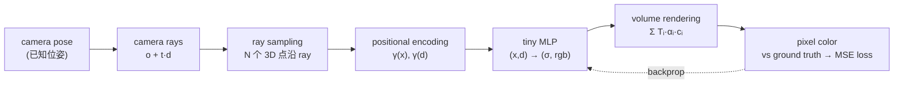

# Lab 5 · NeRF / Gaussian Splatting

**中文** | [English](README_EN.md)

[](https://colab.research.google.com/github/overdued/world-model-spatial-intelligence-course/blob/main/labs/lab05_nerf_gaussian_splatting/notebook.ipynb)

## Goal

理解 **2D observations → 3D representation → novel view synthesis** 这条链路:在代码内解析生成一个 tiny synthetic scene 的 30 张多视角"照片"(含已知相机位姿),从零手写一个 **tiny NeRF**(positional encoding、camera rays、ray sampling、MLP、volume rendering 全部可见),在 CPU 上数分钟训练到 novel view 肉眼可辨,并渲染 360° 环绕 GIF。不调用 nerfstudio 等任何重型库。

## You Will Learn

- NeRF 的核心思想:用一个 MLP 表示场景 `F_θ(x, d) → (σ, rgb)`,渲染即对每条 camera ray 做 volume rendering 积分;
- positional encoding 为什么必不可少(MLP 的 spectral bias),以及频率数 `L` 控制的 trade-off;
- "σ 只看位置、颜色才看方向"这一架构选择背后的物理约束(view-independent 几何 vs view-dependent 高光);
- 深度如何从 σ 的积分权重中**无监督涌现**;
- 视角覆盖决定 novel view 质量:少视角下的 floater 伪影与 train/novel PSNR gap;
- 3D Gaussian Splatting 与 NeRF 的体渲染公式本质相同,只是换成显式高斯 + splatting(α-blending),换来实时渲染;你会亲手训练一个 tiny 3DGS(3D→2D 协方差投影、深度排序、α-blending 全部是可见的 PyTorch 代码),并在同样的视角上与 NeRF 对比;
- **NeRF/3DGS 是 spatial world representation(静态、被动观察),不是完整的 world model**(无 action、无 dynamics)——与 Lab 2–4 的对比贯穿全课。

## Concept

给相机拍下的 N 张照片及其位姿,NeRF 不重建 mesh 或点云,而是直接优化一个连续的体辐射场:空间中每一点有密度 σ(多少物质)和方向相关的颜色 c。渲染一张图像 = 对每个像素发出 ray → 沿 ray 采样 → 查询 MLP → 用 transmittance × α 加权积分出像素颜色。整条链路可微,用渲染结果与真实照片的 MSE 反向传播,MLP 逐渐"凝结"出场景的 3D 结构 —— 之后可以从**任意**位姿重新渲染。

## Architecture



## Run

**Local**

```bash
pip install -r requirements.txt
jupyter nbconvert --execute --to notebook --inplace notebook.ipynb
```

**Colab**

[](https://colab.research.google.com/github/overdued/world-model-spatial-intelligence-course/blob/main/labs/lab05_nerf_gaussian_splatting/notebook.ipynb)

## Experiment

- **少视角退化实验**(notebook Section 8):只用 8 个训练视角(同样的网络与迭代数)重训,对比 30 视角模型在 held-out novel views 上的 PSNR 与画面 —— 观察 train PSNR 依然虚高、novel view 出现雾状伪影(floater)、train/novel gap 拉大的过拟合签名。

## Expected Results

- 30 个 48×48 训练视角网格(`assets/training_views.png`),代码内解析生成、零下载;
- 训练 loss 稳定下降约两个数量级,train PSNR 升至 ~25 dB(`assets/loss_psnr.png`);
- novel view synthesis 清晰可辨:五个球的位置/颜色/遮挡关系正确,高光方向合理,held-out novel view PSNR ≈ 25–27 dB,train/novel gap 仅几个 dB(`assets/novel_views.png`);
- 深度图正确反映球的前后关系(近红远蓝),尽管训练时**没有任何深度监督**(`assets/depth_maps.png`);
- 60 帧 360° 环绕 GIF,画面平滑、无明显漂浮伪影(`assets/orbit.gif`);
- 8 视角重训:novel view 明显退化(模糊/伪影),train/novel gap 显著拉大(`assets/few_views.png`);
- tiny 3DGS(Advanced Extension B):300 个高斯、4,200 个参数,CPU 上约 20 秒训完;novel view PSNR ≈ 24–25 dB(NeRF ≈ 27 dB),边缘更软但几何与颜色正确,每帧渲染比 NeRF 快约 4–6 倍(`assets/gaussian_splatting_3d.png`);
- 全程 CPU,notebook 端到端约 5 分钟。

## Exercises

- ✏️ **改 positional encoding 频率数**:`L_POS` 从 6 降到 2(画面糊掉)再升到 10(过拟合/噪声),体会频率数控制的偏差-方差 trade-off;
- ✏️ **改 ray 采样点数**:`N_SAMPLES` 从 32 降到 8,观察渲染锐度与深度图的退化,进而思考原 NeRF 的 coarse→fine hierarchical sampling 解决了什么;
- ✏️ **改视角数**:Section 8 已演示 8 视角;试着用 15 个视角重训,画一条 "视角数 → novel PSNR" 曲线,找到性价比拐点。

## Advanced Extension

- **3DGS 概念讲解 + 简版 2D Gaussian splatting 演示**:8 个手工放置的 2D 高斯按深度 back-to-front 做 α-blending,直观展示 splatting 的合成机制(与 NeRF 体渲染公式同构);
- **在 CPU 上训练一个 tiny 3D Gaussian Splatting**(Advanced Extension B):300 个可学习的 3D 高斯(位置、log 尺度、四元数旋转、颜色、不透明度),用 NeRF 深度图反投影出的点云初始化(代替 SfM),手写可微 splatting 光栅化(EWA 协方差投影 $J W \Sigma W^\top J^\top$、深度排序、α-blending),在同样 30 个视角上用同样的 photometric MSE 训练,不到一分钟。notebook 对比 NeRF 与 3DGS 的参数量、train/novel PSNR 与每帧渲染耗时(`assets/gaussian_splatting_3d.png`),并列出它与真实 3DGS 的差距(adaptive densification、球谐颜色、tile-based CUDA 光栅化、SfM);
- 真实代码库指引:[graphdeco-inria/gaussian-splatting](https://github.com/graphdeco-inria/gaussian-splatting)(官方 CUDA 实现)、[nerfstudio](https://docs.nerf.studio/) `splatfacto`、轻量复现 [gsplat](https://github.com/nerfstudio-project/gsplat)。

## Related Modules

- [/docs/spatial/04-nerf-gaussian-splatting](/docs/spatial/04-nerf-gaussian-splatting)
- [/docs/spatial/03-depth-and-point-clouds](/docs/spatial/03-depth-and-point-clouds)

## Related Papers

- Mildenhall et al. (2020), *NeRF: Representing Scenes as Neural Radiance Fields for View Synthesis*. https://arxiv.org/abs/2003.08934
- Kerbl et al. (2023), *3D Gaussian Splatting for Real-Time Radiance Field Rendering*. https://arxiv.org/abs/2308.04079
- Barron et al. (2021), *Mip-NeRF: A Multiscale Representation for Anti-Aliasing Neural Radiance Fields*. https://arxiv.org/abs/2103.13415

## Common Problems

- **渲染出来全是背景色/一团雾**:检查 ray 的采样区间 `[NEAR, FAR]` 是否覆盖场景(本 Lab 相机半径 3、场景在原点附近,取 [2, 4]);区间太宽会稀释采样密度,太窄会切掉物体。
- **训练视角清晰、novel view 崩坏**:典型的视角覆盖不足或过拟合 —— 先看 train/novel PSNR gap;增加训练视角数、让视角覆盖一个仰角"带"而不只是一个"环"。
- **画面整体偏灰、对比度低**:`render_rays` 里的背景合成项 `(1 - acc)·BG_COLOR` 与 GT 背景色不一致;两者必须相同。
- **改了 `L_POS`/`L_DIR` 后 shape 报错**:positional encoding 的输出维度是 `C + 2·C·L`,记得同步更新 `IN_POS`/`IN_DIR`。
- **Colab 上慢**:本 Lab 设计为纯 CPU(tiny MLP ~1.5 万参数、3000 步);GPU 对小 batch 反而可能因传输开销无收益,保持 CPU runtime 即可。
