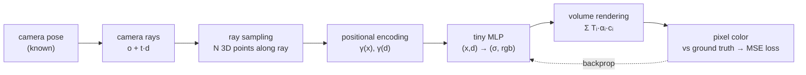

# Lab 5 · NeRF / Gaussian Splatting

**English** | [中文](README.md)

[](https://colab.research.google.com/github/overdued/world-model-spatial-intelligence-course/blob/main/labs/lab05_nerf_gaussian_splatting/notebook_en.ipynb)

> The notebook for this page is [`notebook_en.ipynb`](notebook_en.ipynb) (English). The original Chinese notebook is [`notebook.ipynb`](notebook.ipynb); both run the same code.

## Goal

Understand the **2D observations → 3D representation → novel view synthesis** pipeline: analytically generate 30 multi-view "photos" of a tiny synthetic scene (with known camera poses) in code, hand-write a **tiny NeRF** from scratch (positional encoding, camera rays, ray sampling, MLP, and volume rendering all fully visible), train it on CPU in a few minutes until novel views are visually recognizable, and render a 360° orbit GIF. No heavy libraries such as nerfstudio are used.

## You Will Learn

- The core idea of NeRF: representing a scene with an MLP `F_θ(x, d) → (σ, rgb)`, where rendering means integrating volume rendering along each camera ray;
- Why positional encoding is indispensable (the spectral bias of MLPs), and the trade-off controlled by the number of frequencies `L`;
- The physical constraint behind the architectural choice "σ depends only on position; only color depends on direction" (view-independent geometry vs view-dependent specularity);
- How depth **emerges without supervision** from the integration weights of σ;
- View coverage determines novel-view quality: floater artifacts under few views and the train/novel PSNR gap;
- 3D Gaussian Splatting and NeRF share essentially the same volume-rendering formula — 3DGS just swaps in explicit Gaussians + splatting (α-blending) to gain real-time rendering. You train a tiny 3DGS yourself (3D→2D covariance projection, depth sorting, α-blending, all in visible PyTorch) and compare it with the NeRF on the same views;
- **NeRF/3DGS is a spatial world representation (static, passively observed), not a complete world model** (no action, no dynamics) — this comparison with Labs 2–4 runs through the whole course.

## Concept

Given N photos taken by a camera together with their poses, NeRF reconstructs neither a mesh nor a point cloud; instead it directly optimizes a continuous volumetric radiance field: every point in space has a density σ (how much matter) and a direction-dependent color c. Rendering an image = casting a ray per pixel → sampling along the ray → querying the MLP → integrating the pixel color weighted by transmittance × α. The whole pipeline is differentiable; backpropagating the MSE between the render and the real photo, the MLP gradually "condenses" the scene's 3D structure — which can then be re-rendered from **any** pose.

## Architecture



## Run

**Local**

```bash
pip install -r requirements.txt
jupyter nbconvert --execute --to notebook --inplace notebook_en.ipynb
```

**Colab**

[](https://colab.research.google.com/github/overdued/world-model-spatial-intelligence-course/blob/main/labs/lab05_nerf_gaussian_splatting/notebook_en.ipynb)

## Experiment

- **Few-view degradation experiment** (notebook Section 8): retrain with only 8 training views (same network and iteration count), and compare against the 30-view model in PSNR and visuals on held-out novel views — observe the overfitting signature: train PSNR stays deceptively high, novel views show foggy artifacts (floaters), and the train/novel gap widens.

## Expected Results

- A grid of 30 training views at 48×48 (`assets/training_views.png`), analytically generated in code with zero downloads;
- Training loss steadily drops by about two orders of magnitude, and train PSNR rises to ~25 dB (`assets/loss_psnr.png`);
- Novel view synthesis is clearly recognizable: the five spheres' positions/colors/occlusions are correct, highlight directions are plausible, held-out novel-view PSNR ≈ 25–27 dB, and the train/novel gap is only a few dB (`assets/novel_views.png`);
- Depth maps correctly reflect the front-back ordering of the spheres (near red, far blue), even though training used **no depth supervision at all** (`assets/depth_maps.png`);
- A 60-frame 360° orbit GIF, smooth with no obvious floating artifacts (`assets/orbit.gif`);
- The 8-view retrain: novel views degrade noticeably (blur/artifacts), and the train/novel gap widens significantly (`assets/few_views.png`);
- The tiny 3DGS (Advanced Extension B): 300 Gaussians, 4,200 parameters, trained in about 20 s on CPU; novel-view PSNR ≈ 24–25 dB (NeRF ≈ 27 dB), with softer edges but correct geometry and colours, and each frame renders about 4–6× faster than NeRF (`assets/gaussian_splatting_3d.png`);
- Entirely on CPU; the notebook runs end-to-end in about 5 minutes.

## Exercises

- ✏️ **Change the number of positional-encoding frequencies**: drop `L_POS` from 6 to 2 (the image blurs), then raise it to 10 (overfitting/noise) — feel the bias-variance trade-off controlled by the frequency count;
- ✏️ **Change the number of ray samples**: reduce `N_SAMPLES` from 32 to 8 and observe the degradation of rendering sharpness and depth maps; then think about what problem the original NeRF's coarse→fine hierarchical sampling solves;
- ✏️ **Change the number of views**: Section 8 already demonstrates 8 views; try retraining with 15 views, plot a "view count → novel PSNR" curve, and find the cost-performance inflection point.

## Advanced Extension

- **3DGS concept walkthrough + a minimal 2D Gaussian splatting demo**: 8 hand-placed 2D Gaussians α-blended back-to-front by depth, giving an intuitive picture of splatting's compositing mechanism (isomorphic to NeRF's volume-rendering formula);
- **A tiny 3D Gaussian Splatting, trained on CPU** (Advanced Extension B): 300 learnable 3D Gaussians (position, log-scale, quaternion rotation, colour, opacity), initialized from a point cloud back-projected from the NeRF's depth maps (standing in for SfM), rendered with a hand-written differentiable splatting rasterizer (EWA covariance projection $J W \Sigma W^\top J^\top$, depth sort, α-blending) and trained with the same photometric MSE on the same 30 views in under a minute. The notebook compares NeRF and 3DGS on parameter count, train/novel PSNR and render time per frame (`assets/gaussian_splatting_3d.png`), then lists what separates it from real 3DGS (adaptive densification, spherical-harmonics colour, tile-based CUDA rasterization, SfM);
- Pointers to real codebases: [graphdeco-inria/gaussian-splatting](https://github.com/graphdeco-inria/gaussian-splatting) (official CUDA implementation), [nerfstudio](https://docs.nerf.studio/) `splatfacto`, and the lightweight reproduction [gsplat](https://github.com/nerfstudio-project/gsplat).

## Related Modules

- [/docs/spatial/04-nerf-gaussian-splatting](/docs/spatial/04-nerf-gaussian-splatting)
- [/docs/spatial/03-depth-and-point-clouds](/docs/spatial/03-depth-and-point-clouds)

## Related Papers

- Mildenhall et al. (2020), *NeRF: Representing Scenes as Neural Radiance Fields for View Synthesis*. https://arxiv.org/abs/2003.08934
- Kerbl et al. (2023), *3D Gaussian Splatting for Real-Time Radiance Field Rendering*. https://arxiv.org/abs/2308.04079
- Barron et al. (2021), *Mip-NeRF: A Multiscale Representation for Anti-Aliasing Neural Radiance Fields*. https://arxiv.org/abs/2103.13415

## Common Problems

- **The render is all background color or a foggy blob**: check whether the ray sampling interval `[NEAR, FAR]` covers the scene (in this lab the camera radius is 3 and the scene sits near the origin, so use [2, 4]); too wide an interval dilutes sampling density, too narrow clips the objects.
- **Training views are sharp but novel views break down**: typical insufficient view coverage or overfitting — check the train/novel PSNR gap first; add more training views, and make the views cover an elevation "band" rather than just a "ring".
- **The image is overall grayish with low contrast**: the background-compositing term `(1 - acc)·BG_COLOR` in `render_rays` is inconsistent with the ground-truth background color; the two must be identical.
- **Shape errors after changing `L_POS`/`L_DIR`**: the output dimension of positional encoding is `C + 2·C·L`; remember to update `IN_POS`/`IN_DIR` accordingly.
- **Slow on Colab**: this lab is designed for pure CPU (tiny MLP with ~15k parameters, 3000 steps); a GPU gains nothing for small batches due to transfer overhead — keep the CPU runtime.
