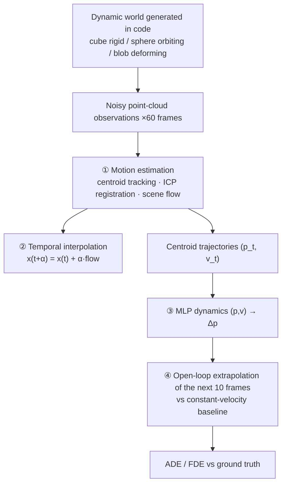

# Lab 6 · Dynamic 3D / 4D Worlds

**English** | [中文](README.md)

[](https://colab.research.google.com/github/overdued/world-model-spatial-intelligence-course/blob/main/labs/lab06_dynamic_4d_worlds/notebook_en.ipynb)

> The notebook for this page is [`notebook_en.ipynb`](notebook_en.ipynb) (English). The original Chinese notebook is [`notebook.ipynb`](notebook.ipynb); both run the same code.

Spatial track: adding the time axis to static 3D representations. On a three-object dynamic point-cloud scene generated in code (a rigid cube / an orbiting sphere / a breathing deforming blob, with noisy observations), you will complete **motion estimation (centroid tracking + hand-written ICP registration + scene flow) → temporal interpolation → MLP dynamics learning → extrapolation 10 frames into the future**, visualizing the entire pipeline with 3D animations.

## Goal

Understand the essential gain of a 4D representation (3D + time) over static 3D: from "what does the world look like" to "where will the world be in the next second." Rather than building a large-scale 4D reconstruction, this lab implements the four core capabilities of a 4D world model — motion estimation, temporal interpolation, dynamics fitting, and future prediction — one by one in a toy scene that runs in a few minutes on CPU.

## You Will Learn

- Static (x, y, z) vs dynamic (x, y, z, t): which state variables a snapshot representation throws away
- Hand-written ICP-style rigid registration (nearest-neighbor matching + Kabsch/SVD iteration) and per-point scene flow
- Temporal interpolation: synthesizing intermediate moments between two frames using the motion field
- World-model prediction in 3D space: autoregressive extrapolation with MLP dynamics vs a constant-velocity prior, evaluated with ADE/FDE
- The weakness of learned dynamics: extrapolation outside the training distribution has no guarantees, and open-loop error compounds with the horizon

## Concept

A point cloud is a snapshot: the geometry is complete, but without a dimension that indexes time, it cannot in principle answer "where will it be in the next second." A 4D representation makes motion and history first-class citizens of the representation. Mainstream 4D methods (DynamicFusion → D-NeRF → 4D-GS) share the "canonical space + deformation field" paradigm; this lab's canonical objects + per-frame motion transforms are its toy version, centroid/scene flow is the microscopic dynamics, and MLP dynamics extrapolation corresponds to what the world model's predict step looks like in 3D space.

## Architecture



## Run

**Local** (CPU is sufficient, about 1–2 minutes total):

```bash
pip install -r requirements.txt
jupyter nbconvert --execute --to notebook --inplace notebook_en.ipynb
# or interactively: jupyter notebook notebook_en.ipynb
```

**Colab**: [](https://colab.research.google.com/github/overdued/world-model-spatial-intelligence-course/blob/main/labs/lab06_dynamic_4d_worlds/notebook_en.ipynb) (the first cell installs dependencies automatically; no GPU needed)

## Experiment

Core comparison (same trajectories, same rollout start at frame 49, extrapolating 10 frames into the future; the only variable = the dynamics model):

| Group | Dynamics model | Parameters |
|---|---|---|
| CV baseline | Δp = v (constant-velocity prior) | 0 |
| MLP dynamics | (p, v) → Δp, 2 hidden layers, hidden=32 | ~1.7k |

Training data: noisy centroid trajectories from the first 49 frames (3 objects × 49 transitions = 147 pairs); the last 10 frames are held out for evaluation.

## Expected Results

- **ICP registration**: the estimated rotation error for the cube between adjacent frames is about **1–2°**, and the translation error is about **0.02** (scene scale ~2).
- **Future prediction (10 frames, typical values)**: on the sphere (orbital motion), MLP FDE ≈ **0.16** vs CV ≈ **0.89** — the learned dynamics captures centripetal acceleration and cuts the error to 1/5; on the cube (constant-velocity straight line), CV is actually more accurate (FDE ≈ 0.01 vs MLP ≈ 0.2), exposing the extrapolation weakness of learned models; on the blob (sinusoidal bobbing), the MLP wins slightly.
- **Animations**: `assets/dynamic_scene.gif` (60 frames of point-cloud evolution with an orbiting camera), `assets/interpolation.gif` (slow motion of 4 synthesized intermediate moments between two frames), `assets/prediction.gif` (red MLP-predicted point clouds vs blue actual ones — red mostly covers blue on sphere/blob, while visible drift appears at the cube's tail).
- Other artifacts: `assets/static_vs_dynamic.png`, `assets/scene_flow.png`, `assets/training_loss.png`, `assets/future_trajectories.png`, `assets/prediction_error.png`.

## Exercises

- ✏️ **Non-rigid deformation**: increase `BREATH_AMP`/`BREATH_OMEGA` and observe which assumption fails first — scene flow, centroid tracking, or rigid-translation prediction.
- ✏️ **Multi-object occlusion**: randomly drop 30% of points per frame (or do biased occlusion culling by line-of-sight depth), compare how centroid/ICP errors change, and connect this to the "insufficient observation" concept in Module 05.
- ✏️ **Prediction horizon**: rerun with `H = 5 / 20`, compare how fast the ADE/FDE of the two models degrade, and observe the periodic structure of the sphere's error curve.

## Advanced Extension

The path from this toy pipeline to real 4D representations (organized by paradigm):

- **Learned scene flow**: replace hand-written NN matching with FlowNet3D-style learned flow, or NSFP-style per-scene optimization — handling large displacements, sparse points, and symmetric repeated structures;
- **Canonical space + deformation field**: D-NeRF maps any timestamp back to a canonical space with an MLP deformation field — a strict generalization of the linear interpolation in Section 6.1, supporting **any time × any viewpoint** queries;
- **4D Gaussian Splatting / Dynamic 3D Gaussians**: turn Gaussian primitive parameters into functions of time, unifying reconstruction and tracking into a single optimization while keeping 3DGS's real-time rendering;
- **Stochasticity and multimodal futures**: this lab's world is deterministic; borrowing the RSSM idea from Lab 3, a stochastic latent can express the 3D version of "same history, multiple futures."

## Related Modules

- [/docs/spatial/05-dynamic-4d-worlds](https://github.com/overdued/world-model-spatial-intelligence-course/blob/main/website/docs/spatial/05-dynamic-4d-worlds.mdx) — the canonical + deformation paradigm, scene flow, dynamic occupancy, insufficient observation
- [/docs/spatial/03-depth-and-point-clouds](https://github.com/overdued/world-model-spatial-intelligence-course/blob/main/website/docs/spatial/03-depth-and-point-clouds.mdx) — where point-cloud observations come from
- [/docs/spatial/06-state-estimation](https://github.com/overdued/world-model-spatial-intelligence-course/blob/main/website/docs/spatial/06-state-estimation.mdx) — next step: 3D tracking with alternating predict/update

## Related Papers

- Newcombe, Fox & Seitz (2015), *DynamicFusion: Reconstruction and Tracking of Non-rigid Scenes in Real-Time* (CVPR 2015).
- Pumarola et al. (2021), *D-NeRF: Neural Radiance Fields for Dynamic Scenes*. https://arxiv.org/abs/2011.13961
- Wu et al. (2024), *4D Gaussian Splatting for Real-Time Dynamic Scene Rendering*. https://arxiv.org/abs/2310.10642
- Luiten et al. (2024), *Dynamic 3D Gaussians: Tracking by Persistent Dynamic View Synthesis*. https://arxiv.org/abs/2310.08528
- Liu, Qi & Guibas (2019), *FlowNet3D: Learning Scene Flow in 3D Point Clouds*. https://arxiv.org/abs/1806.01411

## Common Problems

- **GIFs are all black or points are invisible**: make sure the 3D figures actually render after `%matplotlib inline`; on Colab, if `ax.scatter`'s `s` is too small, raise it to 8–10.
- **ICP estimates are completely wrong**: check whether you fed point clouds from two different objects into `icp_rigid`; NN matching requires the inter-frame displacement to be smaller than the inter-point spacing — increasing `OMEGA_CUBE`/`V_CUBE` beyond that scale will necessarily fail, which is itself an observation point of the exercise.
- **The MLP is worse than CV on all objects**: most likely too few training epochs or too large a learning rate, so it never converged (check whether `training_loss.png` drops to ~1e-6); alternatively, after changing scene parameters the motion may no longer be Markov in (p, v) (e.g., giving the blob a time dependence that cannot be inferred from the state).
- **The cube's red point cloud drifts farther and farther in prediction.gif**: normal behavior, not a bug — the cube's constant-velocity drift takes the rollout region outside the training distribution, which is exactly the extrapolation weakness of learned dynamics discussed in Sections 7–9.
