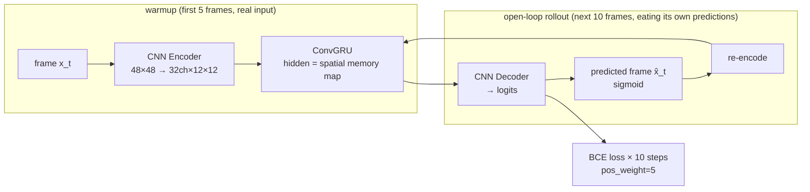

# Lab 7 · Video World Model

**English** | [中文](README.md)

[](https://colab.research.google.com/github/overdued/world-model-spatial-intelligence-course/blob/main/labs/lab07_video_world_model/notebook_en.ipynb)

> The notebook for this page is [`notebook_en.ipynb`](notebook_en.ipynb) (English). The original Chinese notebook is [`notebook.ipynb`](notebook.ipynb); both run the same code.

## Goal

Train a minimal **video world model** in a few minutes on pure CPU: generate Moving Shapes videos in code (3 geometric shapes moving at constant velocity and bouncing off walls, 16 frames at 48×48), predict the next 10 frames from the first 5 using a **CNN Encoder + hand-written ConvGRU + CNN Decoder**, and quantitatively demonstrate **rollout degradation** (error growth from 1-step → 5-step → 10-step, frame sequences going from sharp to blurry ghosts).

## You Will Learn

- Why **video prediction is the generative form of a world model** (the pixel-space version of the same skeleton as Lab 2's latent dynamics);
- **ConvGRU**: GRU gates implemented with 3×3 convolutions, where the hidden state is a "memory map" that preserves spatial structure (the core is only 4 lines);
- **Autoregressive rollout loss** vs teacher forcing: making the training distribution equal the deployment distribution to avoid exposure bias;
- **Long-horizon drift / compounding error**: predicted frames are fed back into the model, so errors accumulate and amplify with the horizon;
- Why a deterministic per-pixel loss leads to **blurry predictions** (averaging over multimodal futures);
- How distribution shift (faster motion) lifts the entire drift curve — a preview of Lab 10.

## Concept

The essence of a world model is "a model that can imagine the future." Video prediction materializes this imagination directly as pixel frames: to predict the future, the model must internalize physical regularities such as object inertia and bouncing. Two fundamental difficulties:

1. **Multimodal futures** → a deterministic MSE/BCE model outputs the "average future" → blurriness;
2. **Compounding error** → predictions are fed back into the model → errors amplify step by step → drift.

Large-scale video world models (VideoGPT, Genie, Sora) conceptually do the same thing; they just express multimodal futures with discrete tokens + transformers or diffusion, thereby avoiding the "averaging."

## Architecture



## Run

**Local** (CPU, about 2–4 minutes):

```bash
pip install -r requirements.txt
jupyter nbconvert --execute --to notebook --inplace notebook_en.ipynb
```

**Colab**:

[](https://colab.research.google.com/github/overdued/world-model-spatial-intelligence-course/blob/main/labs/lab07_video_world_model/notebook_en.ipynb)

## Experiment

Section 8 of the notebook includes a guided experiment: the **fast-motion stress test** — without changing the model or retraining, multiply the test-set speed by 2.5 (mild OOD) and rerun the per-frame error curve, directly showing that "one-step degradation is mild while multi-step drift is amplified."

## Expected Results

- Training takes about 2–3 minutes (600 steps, batch 16, ~68K parameters), with the loss steadily decreasing;
- **GT vs Prediction side-by-side plot**: context frames match; predicted frames are roughly correct in position and get progressively blurrier with the horizon, with multiple shapes smearing together late in the rollout;
- **Per-frame error curve**: 1-step MSE ≈ 0.03, 5-step ≈ 3–4×, 10-step ≈ 5–6× (a clear demonstration of rollout degradation);
- **Prediction GIF**: `assets/prediction_rollout.gif` (GT on the left and prediction on the right, played in sync);
- **Speed stress**: at ×2.5 speed the entire error curve shifts up and its slope steepens;
- Artifacts: `assets/gt_vs_pred.png`, `assets/prediction_rollout.gif`, `assets/rollout_degradation.png`, `assets/speed_stress.png`.

## Exercises

- ✏️ **Change the prediction length**: change `FUT` from 10 to 15 (requires increasing `T=16` to 21) and observe after which horizon the error curve saturates — what does the saturation point mean?
- ✏️ **Change the frame count / context length**: reduce `CTX` from 5 to 2 — how much worse does the 1-step error get? What is the minimum number of context frames needed to infer velocity?
- ✏️ **Change the model capacity**: adjust `H_CH` from 32 to 16 / 64, compare training time, 1-step sharpness, and 10-step error, and find the sweet spot within the CPU budget.
- ✏️ **Action-conditioned variant**: add a global "wind force" `a_t ∈ R²` per frame (perturbing velocities in `make_video`) and concatenate the action channels into the ConvGRU input; once conditioned, the model can support Lab-4-style "action sequence → imagined trajectory."
- ✏️ **Teacher-forcing control**: retrain with the rollout in `predict_future` replaced by feeding real frames, and compare the one-step loss and 10-step rollout error (verifying exposure bias).

## Advanced Extension

The final section of the notebook provides concept diagrams and a literature map (discussion only, no runs):

- **Discrete tokens + transformer**: VideoGPT (VQ-VAE + autoregressive transformer), Genie (learning action-controllable world models from unlabeled video);
- **Continuous diffusion**: Video Diffusion Models, Sora (spacetime patches + denoising transformer, naturally expressing multimodal futures → no blur);
- A comparison table with this lab's ConvGRU: future representation / temporal modeling / action conditioning.

## Related Modules

- [/docs/scientist/10-video-world-models](https://github.com/overdued/world-model-spatial-intelligence-course/tree/main/website/docs/scientist/10-video-world-models.mdx) — the course module corresponding to this lab
- Prerequisite: Lab 2 · Latent Dynamics (the latent version of the same skeleton)
- Follow-up: Lab 10 · OOD / Drift Evaluation (systematically quantifying this lab's drift phenomenon)

## Related Papers

- Srivastava et al. (2015), *Unsupervised Learning of Video Representations using LSTMs*. https://arxiv.org/abs/1502.04681
- Shi et al. (2015), *Convolutional LSTM Network: A Machine Learning Approach for Precipitation Nowcasting*. https://arxiv.org/abs/1506.04214
- Denton & Fergus (2018), *Stochastic Video Generation with a Learned Prior* (SVG). https://arxiv.org/abs/1802.07687
- Yan et al. (2021), *VideoGPT: Video Generation using VQ-VAE and Transformers*. https://arxiv.org/abs/2104.10157
- Ho et al. (2022), *Video Diffusion Models*. https://arxiv.org/abs/2204.03458
- Bruce et al. (2024), *Genie: Generative Interactive Environments*. https://arxiv.org/abs/2402.15391
- OpenAI (2024), *Video generation models as world simulators* (Sora). https://openai.com/research/video-generation-models-as-world-simulators

## Common Problems

- **Predicted frames are blurry from the very first step** → undertraining: if the loss is still decreasing, add 200 to `STEPS`; or the learning rate is too low/too high (default 3e-3);
- **Predictions are all black or all gray** → check whether the decoder output forgot the `sigmoid` (logits for training, sigmoid for display/feedback); bright pixels are sparse, so do not remove `pos_weight`;
- **Shape identities cross-contaminate (grayscale mix-up)** → the `H_CH=32` bottleneck is too small; the grayscale identities of three shapes need more channels — try `H_CH=64` (note that training time roughly doubles);
- **Shapes disappear a few steps into the rollout** → partly normal (drift), but if everything goes black within 3 steps, check whether training really used autoregressive rollout rather than teacher forcing;
- **nbconvert execution times out** → reduce `STEPS` from 600 to 400 and `N_TRAIN` from 768 to 512; it finishes in about 3 minutes (the shape of the error curves is unchanged).
