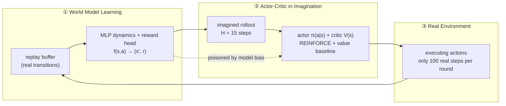

# Lab 9 · World Model + Policy (Tiny Dreamer)

**English** | [中文](README.md)

[](https://colab.research.google.com/github/overdued/world-model-spatial-intelligence-course/blob/main/labs/lab09_world_model_policy/notebook_en.ipynb)

> The notebook for this page is [`notebook_en.ipynb`](notebook_en.ipynb) (English). The original Chinese notebook is [`notebook.ipynb`](notebook.ipynb); both run the same code.

The closing-loop experiment of the Scientist track: connect the components from Labs 0–2 (environment, latent dynamics) to a policy, and run a Tiny Dreamer-style experiment — **the policy is trained mainly on the world model's imagined trajectories** — compare sample efficiency against a model-free baseline, and finally reproduce model bias.

## Goal

In a goal-reaching ball world (Lab 0 physics, modified), implement the full three-loop cycle: train a world model (MLP dynamics + reward head) on a small amount of real data, train an actor-critic with REINFORCE + learned value baseline inside imagination, then collect a small amount of additional real data. Using real environment steps as the x-axis, compare the reward curves of Dreamer-style and model-free learning.

## You Will Learn

- The three-loop cycle of Dyna / Dreamer: World Model Learning → Actor-Critic in Imagination → Real Environment
- Actor-critic updates on imagined rollouts (bootstrap value, advantage, entropy bonus)
- The correct accounting of sample efficiency: x-axis = real environment steps; imagination steps are free
- Model bias / model exploitation: how a policy exploits model errors, and how to reproduce and defend against it

## Concept

In model-free RL, every gradient comes from real interaction; model-based RL splits this bill — real samples are used only to **calibrate the model**, while the policy's gradient signal comes mainly from imagination inside the model. This lab compares two agents with exactly the same actor-critic architecture and hyperparameters: the only variable is whether trajectories come from the real environment or from a learned world model.

## Architecture



## Run

**Local** (CPU is sufficient, about 2–5 minutes total):

```bash
pip install -r requirements.txt
jupyter nbconvert --execute --to notebook --inplace notebook_en.ipynb
# or interactively: jupyter notebook notebook_en.ipynb
```

**Colab**: [](https://colab.research.google.com/github/overdued/world-model-spatial-intelligence-course/blob/main/labs/lab09_world_model_policy/notebook_en.ipynb) (the first cell installs dependencies automatically; no GPU needed)

## Experiment

Core controlled experiment (same ActorCritic, same hyperparameters; the only variable = the source of trajectories):

| Group | Trajectory source | Real-sample budget |
|---|---|---|
| Dreamer-style | Train the world model on 2,500 random seed steps; afterwards, 50 imagination updates + only 100 real collection steps per round | **5,000 steps** |
| Model-free | Policy gradient directly in the real environment (16 episodes/update) | 50,000 steps (10×) |

Additional experiment: re-label the reward as sparse (+1 on arrival) and train the reward head with weighting on rare positive samples, letting the actor train purely in imagination for 600 updates — observe the separation between imagined return (the model's self-assessment) and real return (what the real environment actually pays out), i.e., model bias.

## Expected Results

- **Sample efficiency**: Dreamer-style reaches success rate ≥ 0.9 within about **2,800–3,500 real steps**, with a final return ≈ **-1.4** (success 1.0); model-free is still near random at 5,000 steps (return ≈ -20, success ≈ 0.3), and even with the full **10× budget (50k steps)** only reaches return ≈ -10 / success ≈ 0.7–0.8 — never catching up.
- **Imagined vs real rollout**: for the same action sequence, the imagined trajectory hugs the real one for the first ~10 steps (average position error < 0.05), then drifts slowly (compounding error, echoing Lab 2).
- **Model bias (reproducible)**: in the sparse-reward experiment, imagined return climbs to ~40 while real return stays at ~1 — the policy camps in a fake high-reward region inflated by the reward head and "farms points."
- Artifacts: `assets/reward_curves.png`, `assets/imagined_vs_real.png`, `assets/policy_trajectories.png`, `assets/model_bias.png`, `assets/learned_policy.gif`.

## Exercises

- ✏️ **Imagination horizon**: rerun with `H_IMAG` set to 5 / 40 and observe the effect of myopia vs compounding error on the final return.
- ✏️ **Imagination/real ratio**: adjust `(UPDATES_PER_ITER, REAL_PER_ITER)` to find the ratio with the best sample efficiency, and watch for signs of model bias when imagination is excessive.
- ✏️ **Model bias and data quantity**: reduce the seed data of the sparse experiment from 2,500 steps to 800 steps and observe how the imagined–real gap changes.

## Advanced Extension

A roadmap toward full Dreamer (ordered by payoff):

- **λ-return**: replace the fixed-horizon n-step return with an exponentially weighted mixture of multi-step returns, trading bias/variance more smoothly;
- **Analytic gradients**: remove the `no_grad` in imagination and let gradients flow through the dynamics directly into the actor (Dreamer's stochastic backpropagation), with far lower variance than REINFORCE;
- **Symlog prediction and two-hot reward**: compress the reward scale and stabilize learning over a wide range of returns (a key DreamerV3 trick);
- **KL balancing / RSSM**: replace the deterministic MLP with a recurrent state-space model trained with KL balancing — handling partial observability and multimodal futures;
- **Image observations**: reconnect Lab 2's ConvEncoder and run the same closed loop in latent space.

## Related Modules

- [/docs/scientist/11-world-model-policy](https://github.com/overdued/world-model-spatial-intelligence-course/blob/main/website/docs/scientist/11-world-model-policy.mdx) — the closed-loop panorama from Dyna → Dreamer → DayDreamer and the model-bias toolbox
- [/docs/scientist/08-dreamer](https://github.com/overdued/world-model-spatial-intelligence-course/blob/main/website/docs/scientist/08-dreamer.mdx) — imagination-training details of the Dreamer family

## Related Papers

- Hafner et al. (2019), *Dream to Control: Learning Behaviors by Latent Imagination* (DreamerV1). https://arxiv.org/abs/1912.01603
- Hafner et al. (2023), *Mastering Diverse Domains through World Models* (DreamerV3). https://arxiv.org/abs/2301.04104
- Hansen et al. (2022), *Temporal Difference Learning for Model Predictive Control* (TD-MPC). https://arxiv.org/abs/2203.04955

## Common Problems

- **The model-free curve is worse than random early on**: normal. Early in policy gradient, the policy quickly moves away from uniform randomness (committing to immature action preferences), and greedy evaluation amplifies this; it recovers and surpasses random as samples accumulate.
- **The two curves do not separate**: check whether the x-axis is "real environment steps" rather than update counts; make sure the Dreamer group performs enough imagination updates (≥50 per round).
- **Cannot reproduce model bias**: the gap depends on the reward head's extrapolation error — too much data (positive samples too abundant) or too small a `pos_weight` both shrink the gap; with Section 8's default settings (main-experiment buffer, pos_weight=50) the imagined ≈ 40 vs real ≈ 1 separation reproduces stably.
- **Slower on Colab**: make sure you have not accidentally enabled acceleration settings beyond GPU that introduce overhead; this lab is designed for pure CPU, and Colab's CPU runtime matches the planned timing.
