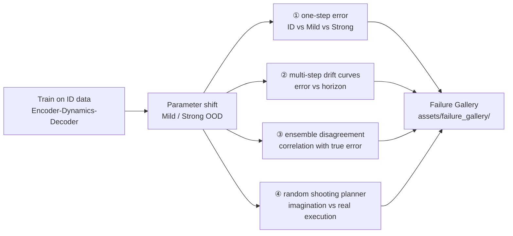

# Lab 10 · OOD / Drift Evaluation

**English** | [中文](README.md)

[](https://colab.research.google.com/github/overdued/world-model-spatial-intelligence-course/blob/main/labs/lab10_ood_drift_evaluation/notebook_en.ipynb)

> The notebook for this page is [`notebook_en.ipynb`](notebook_en.ipynb) (English). The original Chinese notebook is [`notebook.ipynb`](notebook.ipynb); both run the same code.

## Goal

Train a Lab-2-style latent dynamics model (on ID data only), then run a complete reliability-evaluation loop under controlled **distribution shift** (Mild / Strong OOD): **one-step error → multi-step drift → uncertainty proxy → planning / policy failure**, with an automatically generated Failure Gallery.

## You Will Learn

- Why **one-step prediction error does not represent a world model's deployment quality**;
- How to manufacture graded OOD conditions with a parameterized simulator (speed / friction / bouncing / noise / occlusion);
- **Compounding error / drift**: how error grows superlinearly with the horizon in open-loop rollouts;
- Using **ensemble disagreement** as a cheap uncertainty proxy, and testing its correlation with true error;
- The complete failure chain **prediction error → planning error → policy failure** (with a random shooting planner);
- Building a Failure Gallery as a qualitative audit asset for model iteration.

## Concept

World-model evaluation should cover four dimensions (following the CIS6280 L23 evaluation framework):

1. **Accuracy** — one-step / multi-step error on ID;
2. **Robustness** — how much the same metrics degrade under Mild / Strong OOD;
3. **Calibration / Uncertainty** — whether the model can signal when it is unreliable (ensemble disagreement);
4. **Downstream utility** — how errors translate into policy failure when the model is used for planning.

The core phenomenon: **one-step error rises gently with shift, while multi-step rollout error explodes** — the one-step error is fed back as the next input and amplified, and amplification is faster under OOD physics.

## Architecture



## Run

**Local** (CPU, about 3–5 minutes):

```bash
pip install -r requirements.txt
jupyter nbconvert --execute --to notebook --inplace notebook_en.ipynb
```

**Colab**:

[](https://colab.research.google.com/github/overdued/world-model-spatial-intelligence-course/blob/main/labs/lab10_ood_drift_evaluation/notebook_en.ipynb)

## Experiment

Section 12 of the notebook includes a guided experiment: the **speed sweep** (×1.0 → ×3.0, all other parameters kept at ID), comparing the normalized growth curves of one-step and 8-step rollout error, directly showing that "one-step degradation is gentle while multi-step explodes."

## Expected Results

- On ID: clean reconstructions and well-aligned one-step predictions (health checks pass);
- One-step error: Mild slightly above ID, Strong significantly higher (bar chart, log scale);
- **Drift curves**: the three conditions side by side — small gaps at t=1, and Strong OOD about an order of magnitude worse at t=12;
- Ensemble disagreement rises monotonically with shift and correlates positively with true error (Pearson r ≈ 0.6–0.9, with three-color stratification in the scatter plot);
- Planning: for the same planned trajectory, execution on ID basically reaches the goal (★), while execution under Strong OOD deviates noticeably — policy failure;
- `assets/failure_gallery/` receives 4 PNGs (a collage of the 3 worst rollouts + 1 planning-failure figure) and a `captions.txt`.

## Exercises

- ✏️ **Design a new OOD shift**: beyond `CONDITIONS`, define your own parameter set (e.g., anisotropic friction, time-varying speed, a moving occlusion bar), predict at which evaluation level it will be exposed first, then run the experiment to verify.
- ✏️ **Uncertainty-threshold abstention**: set a threshold τ on ensemble disagreement so the planner refuses to execute (abstains) when disagreement > τ. Sweep τ, plot the "abstention rate vs success rate" curve, and find the range that does not over-reject on ID but does reject on Strong OOD.
- ✏️ **Effect of ensemble size**: sweep K from 1 to 9 and observe the changes in the disagreement–error correlation and evaluation cost; with K=1 (single model, no uncertainty), where does the failure chain break first?

## Advanced Extension

- **Deep Ensembles / PETS-style planning**: use the ensemble mean for prediction and disagreement as a cost penalty (uncertainty-penalized MPC), quantifying how much it mitigates OOD policy failure;
- **Calibration**: bucket the disagreement values, draw a reliability diagram (predicted uncertainty vs empirical error), and compute ECE;
- **More systematic evaluation dimensions**: following the CIS6280 L23 framework, complete a four-dimension report card (model card) covering accuracy / calibration / robustness / downstream utility.

## Related Modules

- [/docs/scientist/12-ood-drift-evaluation](https://github.com/overdued/world-model-spatial-intelligence-course/tree/main/website/docs/scientist/12-ood-drift-evaluation.mdx) — the course module corresponding to this lab
- Prerequisites: Lab 2 · Latent Dynamics (model and training pipeline), Lab 4 · MPC / CEM Planning (a more complete planner)

## Related Papers

- Chua et al. (2018), *Deep Reinforcement Learning in a Handful of Trials using Probabilistic Dynamics Models* (PETS). https://arxiv.org/abs/1805.12114
- Lakshminarayanan et al. (2017), *Simple and Scalable Predictive Uncertainty Estimation using Deep Ensembles*. https://arxiv.org/abs/1612.01474
- Hafner et al. (2019), *Learning Latent Dynamics for Planning from Pixels* (PlaNet). https://arxiv.org/abs/1811.04551
- Ha & Schmidhuber (2018), *World Models*. https://arxiv.org/abs/1803.10122
- Venkatraman et al. (2015), *Improving Multi-Step Prediction of Learned Time Series Models*. https://arxiv.org/abs/1502.04991

## Common Problems

- **Under Strong OOD the rollout diverges immediately, without a "gradual collapse" shape** → Strong's speed/friction is too aggressive; first lower the speed to ×2.0 to observe the transitional regime;
- **The three colors mix together in the uncertainty scatter plot with weak correlation** → too few ensemble training steps or identical initialization seeds; make sure each member uses a different `torch.manual_seed`;
- **The planner cannot reach the goal even on ID** → first check the one-step position error on ID (should be < 0.1); then increase `n_samples` or `horizon`;
- **Overly gray predicted frames make the soft-argmax centroid drift to the image center** → this means the open-loop rollout has already diverged (which is exactly what drift looks like); if it happens at step 1, check whether the decoder output needs a sigmoid;
- **nbconvert execution times out** → reduce `STEPS` from 800 to 600 and the rollout `n_roll` from 48 to 32.
