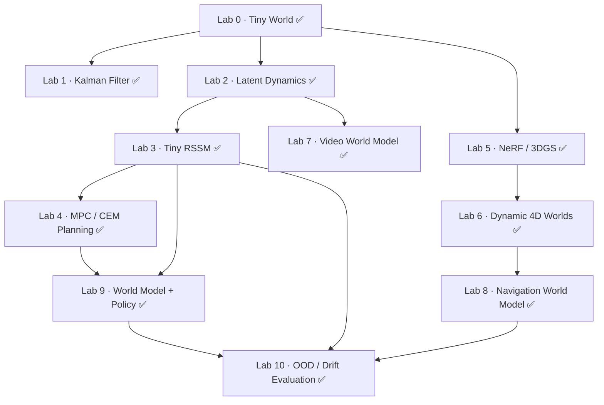

import ColabBadge from '@site/src/components/ColabBadge';

# 动手实验

每个实验都是一个 Colab notebook，可在**免费层**上从头跑到尾，而且全部支持 CPU 运行：小模型、小数据集，必要时提供预计算资源。无需在本地安装任何东西。

:::tip 当前可用
**全部 11 个 Lab 均已上线**，都可以在 CPU 上运行。
:::

Lab 顺序只是建议，不是硬性要求：世界模型科学家路线主要用 Lab 1–4、7、9、10，空间与具身工程师路线主要用 Lab 1、5、6、8、9、10。毕业项目两条路线共享。

Lab 状态统一由 [`labs/manifest.json`](https://github.com/overdued/world-model-spatial-intelligence-course/blob/main/labs/manifest.json) 维护：✅ 可运行（一键运行）/ 🚧 开发中 / 📋 规划中。只有 ✅ 的 Lab 才会显示 Colab 徽章。

## Lab 依赖关系图

世界模型科学家主线：`Lab 0 → 1 → 2 → 3 → 4 → 9 → 10`（观测 → 状态 → 表征 → 动力学 → 想象 → 规划 → 策略 → 评估）。空间主线：`Lab 0 → 5 → 6 → 8 → 10`。视频支线：`Lab 2 → 7`。

| Lab | 你会构建什么 | 状态 | 打开 |
| --- | --- | --- | --- |
| **Lab 0 · Tiny World** | 从零实现一个兼容 Gymnasium 的环境，作为后续所有实验的测试平台 | ✅ 可运行（CPU 约 5 秒） | <ColabBadge lab="lab00_tiny_world" /> |
| **Lab 1 · Kalman Filter** | 手写卡尔曼滤波的预测–更新循环，跟踪带噪声的 2D 目标，并与 dynamax 对比 | ✅ 可运行（CPU 约 3 秒） | <ColabBadge lab="lab01_kalman_filter" /> |
| **Lab 2 · Latent Dynamics** | VAE 编码器 + 潜空间转移模型：最小的“观测 → 潜变量 → 预测”闭环 | ✅ 可运行（CPU 约 1 分钟） | <ColabBadge lab="lab02_latent_dynamics" /> |
| **Lab 3 · Tiny RSSM** | 在图像观测上实现简化版 RSSM（确定性 GRU + 随机潜变量，KL 训练） | ✅ 可运行（CPU 约 3 分钟） | <ColabBadge lab="lab03_tiny_rssm" /> |
| **Lab 4 · MPC / CEM Planning** | 在你学到的潜在动力学上跑 CEM 与 MPPI 规划器：模型 + 规划器 = 控制器 | ✅ 可运行（CPU 约 15 秒） | <ColabBadge lab="lab04_mpc_cem_planning" /> |
| **Lab 5 · NeRF / Gaussian Splatting** | 用两种方式重建静态场景：tiny NeRF 与 3DGS，并比较速度与质量 | ✅ 可运行（CPU 约 3.5 分钟） | <ColabBadge lab="lab05_nerf_gaussian_splatting" /> |
| **Lab 6 · Dynamic 4D Worlds** | 沿时间轴扩展 Lab 5：4D Gaussians 或形变场 NeRF | ✅ 可运行（CPU 约 10 秒） | <ColabBadge lab="lab06_dynamic_4d_worlds" /> |
| **Lab 7 · Video World Model** | 一个小型动作条件视频预测器（diffusion / flow matching），亲眼看漂移如何发生 | ✅ 可运行（CPU 约 2 分钟） | <ColabBadge lab="lab07_video_world_model" /> |
| **Lab 8 · Navigation World Model** | 部分可观测下的导航世界模型流程：反应式、带记忆与世界模型三类智能体对比 | ✅ 可运行（CPU 约 30 秒） | <ColabBadge lab="lab08_navigation_world_model" /> |
| **Lab 9 · World Model + Policy** | 完整的 MBRL 闭环：在想象中训练 actor-critic（Dreamer 风格）或 TD-MPC 风格规划 | ✅ 可运行（CPU 约 45 秒） | <ColabBadge lab="lab09_world_model_policy" /> |
| **Lab 10 · OOD / Drift Evaluation** | 为训练好的世界模型做一次标准化“体检”：校准、rollout 误差、漂移 | ✅ 可运行（CPU 约 2.5 分钟） | <ColabBadge lab="lab10_ood_drift_evaluation" /> |

## 毕业项目

**构建你自己的世界模型**：选一个领域（物理系统、视频与空间世界、机器人学习，或语言与数字智能体），显式声明所建模的**状态、转移、动作接口与评估标准**，然后端到端地构建并评估。详见每条路线的最后一个模块（[世界模型科学家](/docs/scientist/13-capstone) · [空间与具身工程师](/docs/spatial/13-capstone)）。

:::note 起始代码
起始代码和评估脚本位于仓库的 [`labs/`](https://github.com/overdued/world-model-spatial-intelligence-course/tree/main/labs) 目录，notebook 本身在 Colab 上运行。
:::
