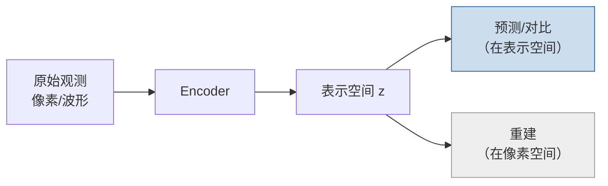

<ModuleProgress id="a04" label="表征学习" />

## 为什么重要

世界模型的上限由表示质量决定：在像素空间预测未来极其困难，在好的表示空间里可能只需线性模型。表示学习是世界模型的"数据引擎"，也是 LeCun 与生成式路线争论的焦点。

## 直观理解

两条学习路线的分歧点：生成式路线（右下）要求表示能**重建像素**；预测式路线（右上，对比学习/JEPA）只要求表示能**预测另一个视图的表示**——后者可以主动丢弃像素细节。

## 核心思想

什么是"好"的表示？对世界模型而言，标准是**预测充分性**：表示要保留预测未来与计算奖励所需的信息，同时丢弃无关细节（光照、纹理噪声）。太小的表示丢信息，太大的表示让动力学学习变难——这就是信息瓶颈的权衡。

**自监督学习（SSL）** 提供了无标签获取表示的三类目标：对比学习（InfoNCE，拉近同一内容的不同视图、推远不同内容）、掩码重建（MAE，重建被遮挡的像素）、以及**联合嵌入预测（JEPA）**——在抽象表示空间预测另一视图的表示，彻底放弃像素级重建。

JEPA 路线（LeCun 倡导）的论据是：像素包含海量与决策无关的细节，逼模型重建像素是浪费容量；V-JEPA / V-JEPA 2 证明视频表示可以只靠"预测被遮挡区域的表示"学出物理直觉。生成式阵营的反驳是：重建是可解释性与可视化的保证，且视频生成的质量本身即是理解程度的证据。这场争论贯穿模块 10 与 路线 B 模块 12。

## 关键概念

- **对比学习与 InfoNCE**：表示空间的"同类相吸、异类相斥"。
- **坍塌（collapse）**：所有输入映射到同一表示的平凡解，SSL 训练的头号敌人。
- **掩码建模**：MAE 式重建 vs JEPA 式表示空间预测。
- **Linear probe**：冻结表示训线性分类器，评估表示质量的经典协议。
- **预测充分性**：表示保留下游预测/控制所需信息的设计准则。

## 核心公式

InfoNCE 损失：

$$\mathcal{L} = -\log \frac{\exp(\mathrm{sim}(z_i, z_i^+)/\tau)}{\sum_j \exp(\mathrm{sim}(z_i, z_j)/\tau)}$$

## 大学课程

| 课程 | Lecture | 链接 |
|---|---|---|
| UPenn CIS 6280 World Models | L05–L06 Self-supervised Representation Learning I/II（对比学习、JEPA、掩码潜变量预测） | [L05 slides](https://jiataogu.me/cis6280-world-models/lectures/lecture-05-representation-learning-i.pdf) |
| Stanford CS231A | L10 Representations & Representation Learning（含 DINO 系列） | [课程主页](https://web.stanford.edu/class/cs231a/) |

## 论文

- **Must Read**：Assran et al. (2023), *Self-Supervised Learning from Images with a Joint-Embedding Predictive Architecture*（I-JEPA，[arXiv:2301.08243](https://arxiv.org/abs/2301.08243)）。
- **Recommended**：He et al. (2022), *Masked Autoencoders Are Scalable Vision Learners*（MAE，[arXiv:2111.06377](https://arxiv.org/abs/2111.06377)）；Chen et al. (2020), *A Simple Framework for Contrastive Learning of Visual Representations*（SimCLR，[arXiv:2002.05709](https://arxiv.org/abs/2002.05709)）。
- **Optional**：Bardes et al. (2024), *Revisiting Feature Prediction for Learning Visual Representations from Video*（V-JEPA，[arXiv:2404.08471](https://arxiv.org/abs/2404.08471)）——JEPA 从图像到视频的延伸，直通 路线 B 模块 12。

## 动手实践

<ColabBadge lab="lab02_latent_dynamics" />

Lab 2 的 encoder 就是一个表示学习器：试着把它的重建损失换成简单的对比目标，观察潜空间结构（t-SNE 可视化）的变化。

## 自测

1. 为什么"重建像素"可能损害用于控制的表示？
2. 对比学习中"坍塌"指什么，如何防止？
3. JEPA 与 MAE 的掩码预测有何本质区别？

显示答案

1. 像素包含大量与决策无关的信息（阴影、纹理、背景杂物）。以重建为目标会强迫表示把容量花在这些细节上，挤压真正预测相关的信息；控制任务只需要"够预测、够算 reward"的表示。
2. 坍塌指 encoder 把所有输入映射到同一向量，InfoNCE 恒为 0 但表示毫无信息。防止手段：负样本对（SimCLR）、stop-gradient 与动量 encoder（BYOL/DINO）、方差正则（VICReg）等。
3. MAE 在**像素空间**重建被掩码区域；JEPA 在**表示空间**预测被掩码区域的表示。后者天然丢弃像素细节，也更接近世界模型"在潜空间预测"的范式。

## 要点回顾

- 表示质量决定世界模型上限；标准是预测充分性而非重建逼真度。
- SSL 三类目标：对比、掩码重建、表示空间预测（JEPA），各有丢弃信息的尺度。
- 重建 vs 预测之争是世界模型领域最重要的路线分歧，后面还会遇到两次。

## 下一模块

[模块 05：潜在动力学](./05-latent-dynamics.mdx)——有了表示，让它动起来。
