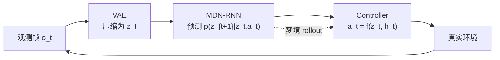

<ModuleProgress id="a07" label="World Models（2018）" />

## 为什么重要

这门课的名字来自这篇 2018 年的论文。它用极简的三段式架构证明了"智能体可以在自己学到的梦境中训练"，并暴露了简单世界模型的典型失败模式——理解它的局限就是理解后续所有改进的动机。

## 直观理解

三个组件**分别独立训练**：VAE 负责看（压缩观测），MDN-RNN 负责做梦（预测潜状态演化），Controller 只有几百个参数，负责在 $z_t, h_t$ 上决策。梦境中训练即把 M 当环境用。

## 核心思想

Ha & Schmidhuber 的 *World Models*（2018）把智能体拆成 **Vision（VAE）→ Memory（MDN-RNN）→ Controller（线性/CMA-ES）** 三个独立模块。关键创新是 **MDN（Mixture Density Network）**：RNN 输出混合高斯的参数而非单点预测，让模型能表达随机未来——这是 RSSM 随机状态的雏形。

最著名的实验是 CarRacing 的**梦境训练**：策略完全在 MDN-RNN 生成的想象轨迹上训练，再零样本部署回真实环境，依然能跑完赛道。这直接演示了模块 01 的核心命题：世界模型可以把真实试错换成想象试错。

论文同样诚实地展示了失败模式：在 VizDoom 实验中，策略学会了**利用梦境的漏洞**（在梦里怪物不发射火球）——这是 model exploitation 的首次著名演示，也是模块 12 的主题。论文的思想脉络可追溯到 Schmidhuber 1990 年代的"好奇心驱动的模型构建控制器"工作。

## 关键概念

- **VAE（Vision）**：把 $64\times64\times3$ 像素压成 32 维 $z_t$。
- **MDN-RNN（Memory）**：输出混合高斯参数，预测随机的下一潜状态与终止概率。
- **Controller**：小参数量策略，直接读 $(z_t, h_t)$，用 CMA-ES 进化。
- **Dream training**：在模型内 rollout 上训练策略，零真实交互。
- **Model exploitation**：策略钻模型空子——梦境里无敌，现实中翻车。

## 核心公式

MDN-RNN 输出混合高斯：

$$p(z_{t+1} \mid z_t, a_t, h_t) = \sum_{k=1}^{K} \pi_k\, \mathcal{N}(z_{t+1} \mid \mu_k, \sigma_k^2)$$

## 大学课程

| 课程 | Lecture | 链接 |
|---|---|---|
| UPenn CIS 6280 World Models | L01–L02（历史脉络）与 L08 Latent World Models | [L08 slides](https://jiataogu.me/cis6280-world-models/lectures/lecture-08-latent-world-models.pdf) |

## 论文

- **Must Read**：Ha & Schmidhuber (2018), *World Models*（[arXiv:1803.10122](https://arxiv.org/abs/1803.10122)）——全文即本模块，配套[交互博客](https://worldmodels.github.io/)。
- **Recommended**：Schmidhuber (1991), *Curious Model-Building Control Systems*（搜索论文名）——思想源头，看模型与好奇心的耦合。
- **Optional**：Oh et al. (2015), *Action-Conditional Video Prediction using Deep Networks in Atari Games*（NeurIPS，搜索论文名）——同期的动作条件预测平行工作。

## 动手实践

Lab 3：tiny RSSM 实现中保留了 World Models 的"分段训练"选项——你可以先各训各的再联合，对比端到端 ELBO 训练的差异。

**Open Lab**：<ColabBadge lab="lab03_tiny_rssm" />

## 自测

1. 为什么三个组件要分开训练而不是端到端？
2. MDN 的混合高斯比单点 MSE 预测好在哪？
3. "策略利用梦境漏洞"暴露了世界模型用于决策的什么根本风险？

显示答案

1. 2018 年的工程现实：端到端训练三个组件计算贵且不稳定；分治让每步各自简单（VAE 无监督、RNN 监督、CMA-ES 无梯度），也符合"模块可替换"的接口哲学。代价是组件目标不一致——Dreamer 系列的端到端 ELBO 正是对此的回应。
2. 单点 MSE 预测会输出随机未来的"平均值"（模糊、不真实）；混合高斯能表达多模分布（车可能左转也可能右转），采样出的梦境才像真实轨迹，否则策略在模糊的梦里学到错误的动力学。
3. 决策优化会主动把 rollout 推向模型误差最大的区域（optimizer 天然寻找模型的漏洞），即 model exploitation / model bias。缓解手段包括短 horizon、不确定性惩罚、真实数据闭环校正——模块 09 与 12 展开。

## 要点回顾

- World Models 2018 用 VAE + MDN-RNN + Controller 首次完整演示"梦境训练"。
- 分段独立训练简单但目标不一致，端到端联合训练（PlaNet/Dreamer）是下一步。
- 梦境漏洞实验预告了 model bias——用模型做决策的永恒主题。

## 下一模块

[模块 08：Dreamer](./08-dreamer.mdx)——把 RSSM、imagination 与 actor-critic 合为一体的标杆系统。
