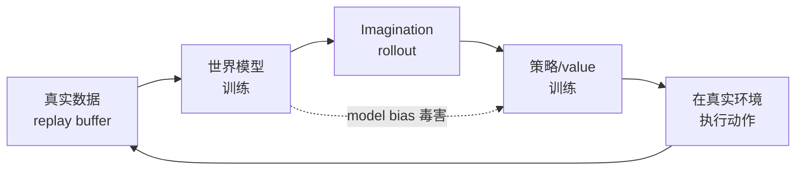

<ModuleProgress id="a11" label="世界模型 + 策略" />

## 为什么重要

前几个模块把模型与策略分开讲，本模块把它们接成闭环：真实数据训模型、模型 imagination 训策略、策略采集新数据再训模型。理解这个循环的动力学（包括它何时崩溃）是 MBRL 工程能力的核心。

## 直观理解

闭环有助推也有毒药：样本效率来自 imagination（绿线），但模型误差会经 imagination 直接毒害策略（红虚线）——model bias 是闭环的头号故障模式。

## 核心思想

MBRL 的系统图景从 **Dyna**（Sutton, 1991）开始：真实经验同时用于直接更新 value/policy 和训练模型，模型再生成虚拟经验辅助学习——"learning, planning, reacting"三位一体。现代系统把 Dyna 的每个部件都升级了：模型换成 RSSM，虚拟经验换成 imagination rollout，规划换成 actor-critic 或 MPC。

闭环的关键工程问题是**交替节奏**：模型与策略谁先训、多久更新一次、模型该在哪些状态分布上被评估。DayDreamer（2022）证明这套闭环可以直接跑在**真实物理机器人**上——四足行走、机械臂抓取在几小时真实交互内学会，样本效率远超 model-free——代价是严格的任务约束（自动复位、安全边界）。

**Model bias** 是闭环的结构性风险：策略优化器会主动寻找模型误差最大的方向（"钻空子"），imagination 中的高回报在真实世界兑现不了。缓解手段构成一个工具箱：短 horizon rollout、概率 ensemble 的不确定性惩罚（PETS）、分支 rollout（MBPO）、value 函数兜底（TD-MPC）——模块 12 会把它们放进统一的评估框架。

## 关键概念

- **Dyna 架构**：真实经验与虚拟经验的混合学习。
- **交替训练**：模型 ↔ 策略的更新节奏与数据分布漂移。
- **Model bias / exploitation**：策略钻模型空子（呼应模块 07 的梦境漏洞）。
- **分支 rollout（MBPO）**：从真实状态出发短程 rollout，限制误差复合。
- **Real-world RL（DayDreamer）**：闭环直接跑在物理机器人上。

## 核心公式

MBPO 的分支 rollout 价值目标：

$$\hat{V}(s) = \sum_{k=0}^{K-1} \gamma^k r_\theta(s_k, a_k) + \gamma^K V_\psi(s_K), \qquad s_0 \text{ 来自真实 buffer}$$

## 大学课程

| 课程 | Lecture | 链接 |
|---|---|---|
| UPenn CIS 6280 World Models | L10 Policy & Value Learning with World Models（Dreamer、TD-MPC、model bias） | [课程主页](https://jiataogu.me/cis6280-world-models/) |

## 论文

- **Must Read**：Wu et al. (2022), *DayDreamer: World Models for Physical Robot Learning*（[arXiv:2206.14176](https://arxiv.org/abs/2206.14176)）。
- **Recommended**：Janner et al. (2019), *When to Trust Your Model: Model-Based Policy Optimization*（MBPO，[arXiv:1906.08253](https://arxiv.org/abs/1906.08253)）；Sutton (1991), *Dyna, an Integrated Architecture for Learning, Planning, and Reacting*（经典论文，搜索论文名）。
- **Optional**：Hansen et al. (2024), *TD-MPC2*（[arXiv:2310.16828](https://arxiv.org/abs/2310.16828)）。

## 动手实践

Lab 9：把 Lab 3 的世界模型接上 actor-critic，在 imagination 中完成完整 MBRL 闭环，与 model-free PPO 对比样本效率。

**Open Lab**：<ColabBadge lab="lab09_world_model_policy" />

## 自测

1. Dyna 与现代 Dreamer 式闭环的对应关系是什么？
2. 为什么 model bias 在策略训练中被放大，而在纯预测中不明显？
3. 分支 rollout 为什么能缓解 model bias？

显示答案

1. Dyna 的"模型生成虚拟经验辅助 Q-learning"对应 Dreamer 的"RSSM imagination 训练 actor-critic"；区别在于现代系统的模型是深度潜动力学、虚拟经验是可微的多步 rollout，但骨架完全一致——Dyna 是 1991 年的原型。
2. 纯预测只是被动拟合数据分布；策略优化是主动搜索：优化器会系统性地把 rollout 推向模型高估回报的区域，相当于对抗性地利用模型误差。预测误差是平均的，bias 是被寻优放大的。
3. 短 rollout（K 步）从真实状态出发，模型误差最多复合 K 步而非整个 episode；horizon 末端由真实数据训练的 value 函数接管。K 是"模型可信度"的显式旋钮——模型越差 K 越小，退化为 model-free。

## 要点回顾

- MBRL 闭环 = 数据 ↔ 模型 ↔ imagination ↔ 策略的循环，Dyna 是其原型。
- 样本效率的代价是 model bias：优化器会对抗性利用模型误差。
- 短 horizon、ensemble、分支 rollout、value 兜底是四大缓解工具——模块 12 给它们配上评估。

## 下一模块

[模块 12：OOD、漂移与评估](./12-ood-drift-evaluation.mdx)——世界模型什么时候会骗人，以及如何发现。
