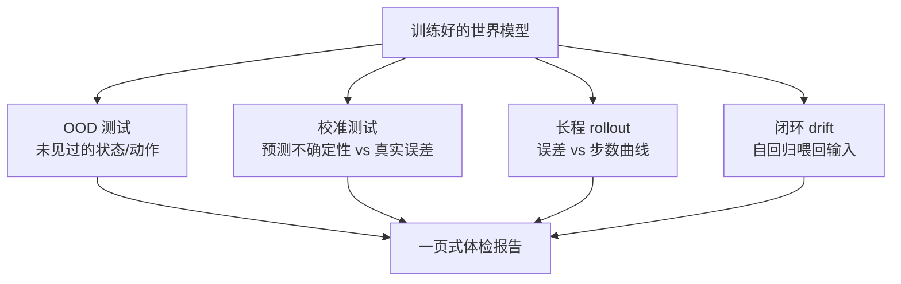

<ModuleProgress id="a12" label="OOD、漂移与评估" />

## 为什么重要

世界模型什么时候会骗人？训练分布内的高分掩盖不了 OOD 崩溃、误差复合与闭环漂移。CIS6280 把"评估世界模型"独立成讲——本模块给前面所有模块训出的模型做一次"体检"，也是 Capstone 的必备方法。

## 直观理解

四类测试攻击模型的四种失效模式。核心思想：**one-step 精度只是入场券**，部署可靠性要在这四个维度上单独度量。

## 核心思想

**OOD（分布外）**：世界模型在训练分布外的状态与动作上还准吗？注意 agent 会**自己制造 OOD**——策略学到新行为后，采集的数据分布就偏离了模型训练时的分布，这是闭环系统的自诱导分布偏移。评估要区分插值（分布内组合）与外推（真正没见过），后者才是硬指标。

**不确定性与校准**：好模型该"知道自己不知道"。区分 aleatoric（环境固有随机，不可消除）与 epistemic（模型知识不足，可被数据消除）；ensemble 与 Bayesian 近似（如 MC dropout）是常用估计手段；校准曲线（预测置信度 vs 实际误差）检验不确定性是否"说真话"——Kalman filter 免费提供校准好的不确定性，学习模型必须为此付出专门努力。

**误差复合与漂移**：one-step 误差 $\epsilon$ 在 rollout 中最坏情形以 $O(\epsilon \cdot \frac{\gamma^H - 1}{1-\gamma})$ 量级复合（折扣视界视角）。视频世界模型的 **closed-loop drift** 是其生成版：伪影逐帧放大。多步训练目标、scheduled sampling、锚定/重同步是主要缓解手段。最终，**评估协议**要把 utility（下游任务收益）、controllability、calibration、OOD、drift、latency、failure mode 做成标准体检表——这正是 CIS6280 L23 的框架，也是本课程 Lab 10 的交付物。

## 关键概念

- **协变量偏移 vs 语义偏移**：分布偏移的两种强度。
- **Aleatoric vs epistemic**：不可消除 vs 可学习消除的不确定性。
- **校准（calibration）**：置信度与真实误差的统计一致性。
- **Rollout 误差界**：one-step 精度与长程可靠性的鸿沟。
- **评估维度全表**：utility / controllability / calibration / OOD / drift / latency / failure mode。

## 核心公式

折扣误差复合界（示意）：

$$\big|V^{\pi}_{\text{model}} - V^{\pi}_{\text{real}}\big| \lesssim \frac{\gamma\, \epsilon}{(1-\gamma)^2}, \qquad \epsilon = \max_{s,a}\, D\big(p_\theta(\cdot\mid s,a),\, p_{\text{real}}(\cdot\mid s,a)\big)$$

## 大学课程

| 课程 | Lecture | 链接 |
|---|---|---|
| UPenn CIS 6280 World Models | L23 Evaluating World Models（utility、controllability、calibration、OOD、intervention、drift、latency、failure mode） | [课程主页](https://jiataogu.me/cis6280-world-models/)（L23 slides 随学期发布） |

## 论文

- **Must Read**：Janner et al. (2019), *When to Trust Your Model: Model-Based Policy Optimization*（MBPO，[arXiv:1906.08253](https://arxiv.org/abs/1906.08253)）——model bias 的形式化与分支 rollout 的理论分析。
- **Recommended**：Hendrycks & Gimpel (2017), *A Baseline for Detecting Misclassified and Out-of-Distribution Examples*（[arXiv:1610.02136](https://arxiv.org/abs/1610.02136)）；Kendall & Gal (2017), *What Uncertainties Do We Need in Bayesian Deep Learning for Computer Vision?*（[arXiv:1703.04977](https://arxiv.org/abs/1703.04977)）。
- **Optional**：Gal & Ghahramani (2016), *Dropout as a Bayesian Approximation*（[arXiv:1506.02142](https://arxiv.org/abs/1506.02142)）。

## 动手实践

Lab 10：给你训出的世界模型做一次标准化体检——校准曲线、rollout 误差曲线、OOD AUROC、drift 时间线，输出一页式报告。

**Open Lab**：<ColabBadge lab="lab10_ood_drift_evaluation" />

## 自测

1. 为什么闭环系统中的 OOD 是"自诱导"的？
2. aleatoric 与 epistemic 不确定性对规划的指导意义有何不同？
3. 为什么生成质量指标（如 FVD）不能替代决策效用评估？

显示答案

1. 策略更新后行为分布改变，新采集的数据偏离模型训练分布；模型在新分布上不准，又导致基于它的策略进一步跑偏——闭环把静态 OOD 变成了动态漂移问题，需要持续重训或主动探索覆盖。
2. epistemic 高的区域应引导**探索**（收集数据消除无知）或在规划中**避险**（不信任模型）；aleatoric 高的区域模型永远不准，只能靠短 horizon 与鲁棒目标（如风险敏感规划）应对。混淆两者会导致错误的探索或过度保守。
3. FVD 度量生成分布与真实分布的视觉相似度，是开环被动指标；决策效用关心的是模型在规划器会实际访问的状态-动作上的预测精度与不确定性诚实度。一个画面精美但物理错误的模型 FVD 可以很好、规划必然失败。

## 要点回顾

- 可靠性四维：OOD、校准、rollout 误差、closed-loop drift，各有专门度量。
- 不确定性的价值在于"知道自己不知道"——Kalman 免费给的，学习模型要专门挣。
- 评估协议本身是研究对象：本课程的 Lab 10 体检表将开源为 eval suite。

## 下一模块

[模块 13：毕业项目：构建你自己的世界模型](./13-capstone.mdx)——把 12 个模块的知识做成你自己的系统。
