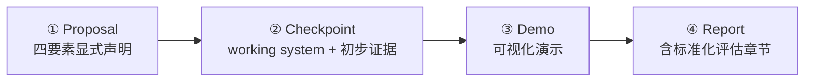

<ModuleProgress id="a13" label="毕业项目：构建你自己的世界模型" />

## 为什么重要

读论文与做 Lab 都是跟着别人定义好的接口走。研究的真功夫在于**自己定义接口**：你的系统的 state 是什么、transition 学什么、action 怎么进、用什么标准说"它成功了"。Capstone 就是这次完整演练。

## 直观理解

四个里程碑继承 CIS6280 期末项目的设计：proposal → checkpoint → presentation → report。每个里程碑都可交付、可评审。

## 核心思想

Capstone 的唯一硬性约束（沿用 CIS6280 的官方表述）：**在一个应用领域探索一种世界建模方法，显式说明 modeled state、transition、action interface 与 evaluation criteria**。模糊的"我训了个视频预测模型"不合格；"state 是 128 维 RSSM 潜状态、transition 是动作条件 GRU+高斯头、action 是 6 维连续力矩、评估用模块 12 的四维体检表"才合格。

四个建议选题方向（沿用 CIS6280 的分类）：

1. **Physical systems**：经典物理/流体/机器人仿真的学习建模（如用 GNS 思想学粒子动力学）；
2. **Video & spatial worlds**：视频预测、4D 场景、交互式世界（如小规模动作条件视频模型）；
3. **Robot learning**：导航/操作任务中的世界模型（与 路线 B Capstone 交汇）；
4. **Language & digital agents**：文本/GUI/工具环境的世界模型（如为代码沙盒建工具后果模型）。

算力预算指导：所有方向都提供 Colab 免费 T4 可完成的档位——缩小分辨率/状态维度/数据量，把精力放在**接口定义与评估严谨性**上，那才是评分点。

## 关键概念

- **四要素声明**：state / transition / action interface / evaluation criteria。
- **里程碑制**：proposal → checkpoint → demo → report，每步可交付。
- **风险分析**：checkpoint 必须列出最大技术风险与退路。
- **标准化评估**：报告必须包含模块 12 的评估章节。
- **算力档位**：为 Colab 免费 GPU 设计最小可行版本。

## 核心公式

本模块以系统设计为主——你的四要素声明里应包含 transition 的显式形式，例如 $p_\theta(s_{t+1} \mid s_t, a_t)$ 的具体参数化与训练目标。

## 大学课程

| 课程 | 项目要求 | 链接 |
|---|---|---|
| UPenn CIS 6280 World Models | Final Project：四要素显式声明 + 四里程碑 | [课程主页](https://jiataogu.me/cis6280-world-models/) |

## 论文

依选题而定（proposal 中列出 3–5 篇与本 Capstone 直接相关的论文）：

- **方向参考**：DreamerV3（[arXiv:2301.04104](https://arxiv.org/abs/2301.04104)）之于方向 1/3；Genie（[arXiv:2402.15391](https://arxiv.org/abs/2402.15391)）之于方向 2；DayDreamer（[arXiv:2206.14176](https://arxiv.org/abs/2206.14176)）之于方向 3。

## 动手实践

本模块即最终的 Hands-on。前置依赖：完成 Lab 1–4 中至少两个，以及 Lab 10 的评估方法（开发中）。

## 自测

1. 为什么"显式定义 action interface"比"选一个模型架构"更重要？
2. checkpoint 里程碑为什么要求写风险分析？
3. 评估章节与 toy demo 的"看起来 work"有何区别？

显示答案

1. 架构是实现细节，接口是科学声明：action 如何进入 transition 决定了你的模型能否被规划器、策略或其他研究者复用。接口定义错了，再好的架构也无法接入任何决策回路；接口定义清楚，换架构只是工程迭代。
2. 研究项目的最大浪费是到报告期才发现核心假设不成立。checkpoint 强制你在已有 working system 和初步证据时盘点最大风险（如"长 rollout 发散""数据量不够"）并给出退路（缩小 horizon、换数据集），把失败提前到可修正的阶段。
3. demo 是存在性证明（存在一条轨迹 work），评估是统计声明（在定义的测试分布上，指标均值与方差是多少、失效模式是什么）。前者可以靠运气，后者必须靠协议——这正是模块 12 存在的意义。

## 要点回顾

- Capstone 的核心不是模型多强，而是四要素定义多清楚、评估多严谨。
- 里程碑制把研究风险前置：proposal 定接口，checkpoint 验可行性，demo 与 report 收证据。
- 完成本模块，你就具备了 CIS6280 期末项目同等的完整世界模型研究训练。

## 下一模块

路线 A 已完成。想理解世界模型在 3D 物理世界的落地，进入 [路线 B 模块 01：什么是空间智能？](../spatial/01-what-is-spatial-intelligence.mdx)；或回到 [Start Here](../start-here/index.mdx) 回顾全局地图。
