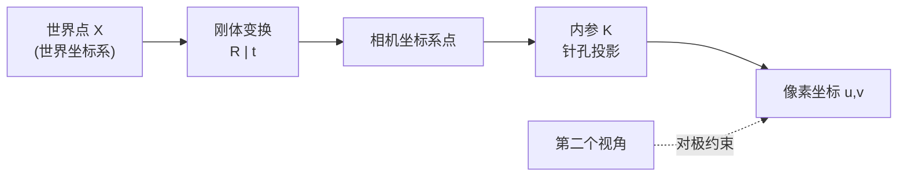

<ModuleProgress id="b02" label="相机与几何" />

## 为什么重要

相机是最基本的"世界→观测"模型（回想 路线 A 模块 02 的观测方程）。不理解投影与多视角约束，后面的深度、NeRF、SLAM 都只是一堆 API。几何是空间智能的母语。

## 直观理解

世界点先经外参 $[R|t]$ 变换到相机坐标系，再经内参 $K$ 投影到像素。两个视角看同一 3D 点产生对极约束——这是无标注情况下多视角监督的来源。

## 核心思想

**针孔相机模型**把 3D 点投影为 2D 像素：内参矩阵 $K$ 编码焦距与主点，外参 $[R|t]$ 编码相机在世界中的位姿。真实镜头还有畸变参数；标定（calibration）就是从棋盘格等已知图案反解这些参数——张正友标定法是工业标准。

**对极几何**刻画两个视角的内在约束：同一 3D 点在两个视图中的像 $x, x'$ 满足 $x'^\top F x = 0$。基础矩阵 $F$（内参未知）/本质矩阵 $E$（内参已知）只依赖两相机的相对位姿，与场景无关——这意味着可以从匹配点反解相机运动（八点法、Nistér 五点法 + RANSAC），再三角化出 3D 结构：这就是 SfM（Structure from Motion）的骨架，也是 COLMAP 到 SLAM 前端共同的经典内核。

几何的另一层纪律是**坐标系管理**：世界系、相机系、本体（body）系的变换链一旦混乱，所有下游结果都是错的。MIT VNAV 用 Lie 群 $SO(3)/SE(3)$ 的严格语言处理旋转——旋转矩阵无奇异但有约束，四元数无奇异性适合优化，这是工程实现的常识起点。

## 关键概念

- **内参 $K$ / 外参 $[R|t]$**：相机自身的光学参数与世界中的位姿。
- **标定**：从已知图案反解内参（张正友法）。
- **对极约束**：$x'^\top F x = 0$，两视图的几何纽带。
- **三角化**：从多视角射线交会恢复 3D 点。
- **旋转表示**：旋转矩阵 / 四元数 / Lie 群，各有奇异与约束的权衡。

## 核心公式

针孔投影：

$$s \begin{bmatrix} u \\ v \\ 1 \end{bmatrix} = K [R \mid t] \begin{bmatrix} X \\ Y \\ Z \\ 1 \end{bmatrix}, \qquad K = \begin{bmatrix} f_x & 0 & c_x \\ 0 & f_y & c_y \\ 0 & 0 & 1 \end{bmatrix}$$

## 大学课程

| 课程 | Lecture | 链接 |
|---|---|---|
| Stanford CS231A | L02–L05（Camera Models、Calibration、多视图几何）+ PS1/PS2 | [课程主页](https://web.stanford.edu/class/cs231a/) |
| ETH/UZH VAMR | L02–L03（透视投影、DLT、PnP）与 Ex01–Ex02 | [课程主页](https://rpg.ifi.uzh.ch/teaching.html) |

## 论文

- **Must Read**：Hartley & Zisserman, *Multiple View Geometry in Computer Vision*（2004，教材，搜索书名）——第 6、9 章是本模块的完整版。
- **Recommended**：Zhang (2000), *A Flexible New Technique for Camera Calibration*（IEEE TPAMI，搜索论文名）；Nistér (2004), *An Efficient Solution to the Five-Point Relative Pose Problem*（搜索论文名）。

## 动手实践

<ColabBadge lab="lab00_tiny_world" />

Lab 0 的自定义环境是理解"观测接口"的热身；几何手感建议用 VAMR 的公开习题（透视投影与 DLT 手写实现）训练。

## 自测

1. 内参未知时两视图约束用 $F$ 还是 $E$，为什么？
2. 为什么单张图像无法恢复绝对尺度？
3. RANSAC 在八点法流程中解决什么问题？

显示答案

1. 用基础矩阵 $F$。本质矩阵 $E = K'^\top F K$ 依赖内参；内参未知时只能估计 $F$（像素坐标层面），已知内参后才能归一化坐标估计 $E$ 并分解出 $R, t$。
2. 针孔投影把深度折叠进尺度因子 $s$：3D 点扩大 λ 倍、距离也扩大 λ 倍，投影像素不变。单视图只有相对几何；绝对尺度需要额外信息（已知物体尺寸、双目基线、IMU）。
3. 匹配点中有大量误匹配（outlier），八点法对噪声敏感；RANSAC 随机抽最小子集解假设、统计内点数，迭代保留最大一致集，把估计从脏数据中拯救出来。

## 要点回顾

- 相机模型 $K[R|t]$ 是"世界→图像"的观测方程，标定就是系统辨识。
- 对极几何给出无标注的多视角约束，是 SfM/SLAM 的几何地基。
- 坐标系纪律与旋转表示的选择是工程实现的第一课。

## 下一模块

[模块 03：深度与点云](./03-depth-and-point-clouds.mdx)——从 2D 像素走向第一批显式 3D 表示。
