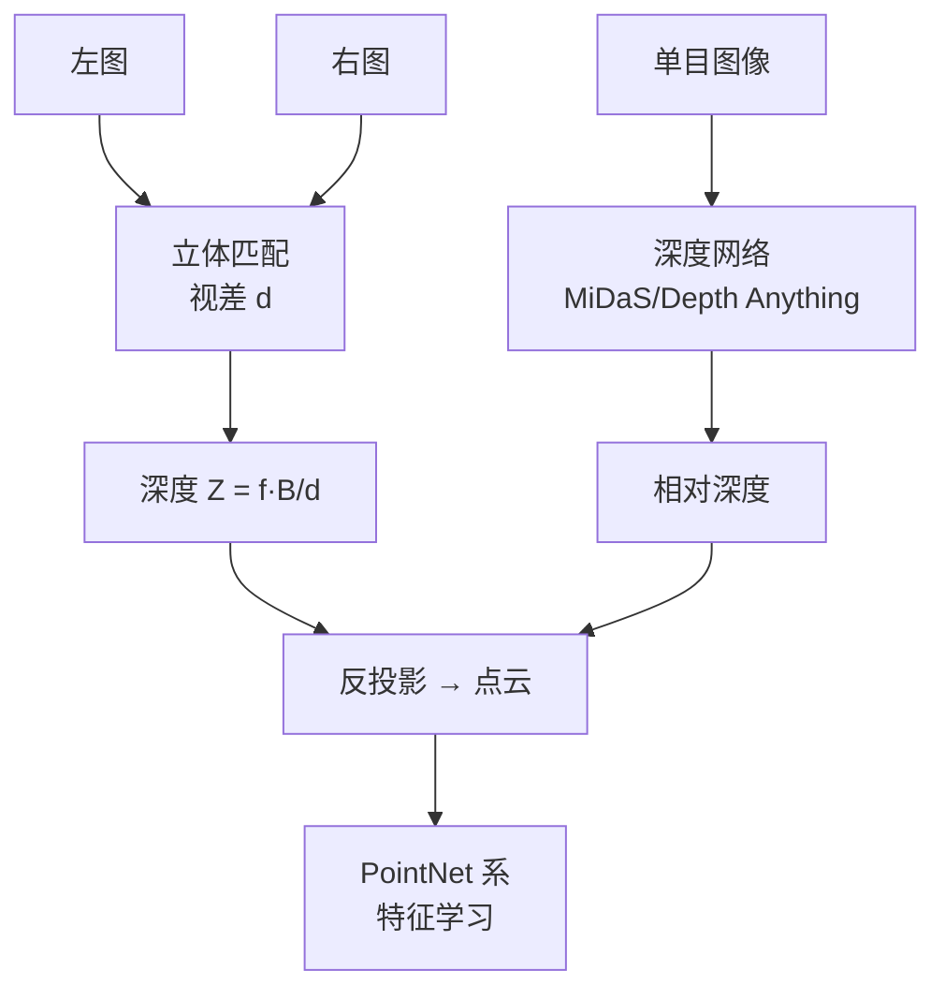

<ModuleProgress id="b03" label="深度与点云" />

## 为什么重要

深度是从 2D 图像通往 3D 世界的第一座桥：有了逐像素深度，图像就能反投影成点云，点云是最通用的显式 3D 表示。自动驾驶、机器人抓取、AR 都建立在这条管线上。

## 直观理解

两条深度路线在点云处汇合：双目几何给出**度量深度**（有绝对尺度），单目网络给出**相对深度**（零样本泛化好但尺度不定）。

## 核心思想

**立体匹配**利用双目视差：同一 3D 点在左右图的横向位移 $d$ 与深度成反比，$Z = fB/d$。经典方法是块匹配 + 正则化，现代方法是代价体（cost volume）+ 3D 卷积或 Transformer。视差估计的精度随距离平方衰减——这是深度传感器的固有物理限制。

**单目深度**是病态问题（无数 3D 场景产生同一图像），全靠学习先验：从 Eigen et al. 2014 的开山之作，到 MiDaS 的混合数据集零样本迁移，再到 Depth Anything 的基础模型路线。工程上常区分相对深度（排序正确、尺度任意）与度量深度（需要标定或多视角约束）。

**点云**是深度反投影后的自然表示：无序、不规则、置换不变。**PointNet**（2017）用逐点 MLP + 对称函数（max pooling）首次直接学习无序点集，PointNet++ 引入层次化局部结构，奠定了点云学习的范式。点云之外，occupancy 与 SDF 等表示（模块 04 的神经场前身）各有分辨率与内存的权衡。

## 关键概念

- **视差-深度关系**：$Z = fB/d$，精度随距离平方恶化。
- **单目深度的尺度歧义**：相对 vs 度量深度。
- **光度一致性自监督**：用多视角重建误差替代深度标注。
- **置换不变性**：点云学习的核心结构约束。
- **Occupancy / SDF**：连续隐式占据与符号距离场表示。

## 核心公式

双目深度：

$$Z = \frac{f \cdot B}{d}$$

## 大学课程

| 课程 | Lecture | 链接 |
|---|---|---|
| CMU 16-825 Learning for 3D Vision | L04 Single-view 3D: Depth；L18 Point Clouds（PointNet/Point Transformer） | [课程主页](https://learning3d.github.io/) |
| Stanford CS231A | L06 Stereo、L11–L12 Monocular Depth + PS3 | [课程主页](https://web.stanford.edu/class/cs231a/) |

## 论文

- **Must Read**：Qi et al. (2017), *PointNet: Deep Learning on Point Sets for 3D Classification and Segmentation*（[arXiv:1612.00593](https://arxiv.org/abs/1612.00593)）。
- **Recommended**：Ranftl et al. (2020), *Towards Robust Monocular Depth Estimation*（MiDaS，[arXiv:1907.01341](https://arxiv.org/abs/1907.01341)）；Godard et al. (2017), *Unsupervised Monocular Depth Estimation with Left-Right Consistency*（[arXiv:1609.03677](https://arxiv.org/abs/1609.03677)）。
- **Optional**：Yang et al. (2024), *Depth Anything*（[arXiv:2401.10891](https://arxiv.org/abs/2401.10891)）；Qi et al. (2017), *PointNet++*（[arXiv:1706.02413](https://arxiv.org/abs/1706.02413)）。

## 动手实践

Lab 5的数据准备阶段会用到本模块：从多视角图像经 COLMAP 解算位姿与稀疏点云——亲手跑一遍就理解全部管线。

**Open Lab**：<ColabBadge lab="lab05_nerf_gaussian_splatting" />

## 自测

1. 为什么双目深度在远处不可靠？
2. 单目深度网络的"尺度歧义"从何而来？
3. PointNet 为什么用 max pooling 聚合点特征？

显示答案

1. 由 $Z = fB/d$ 求导：$\Delta Z \approx \frac{Z^2}{fB}\Delta d$——深度误差随距离平方增长，而视差分辨率受像素限制。物理上基线 $B$ 固定后远处双目退化为单目。
2. 单张图像丢失绝对尺度：把场景和相机距离同比例放大，图像不变。训练数据只能监督相对结构，网络学到的是"深度排序 + 场景先验"，绝对尺度需要额外锚定（传感器、已知尺寸）。
3. 点云是无序集合，网络输出必须对输入点的排列不变。max pooling 是对称函数（与顺序无关），同时提取全局显著特征——PointNet 的理论贡献正是证明对称函数可以逼近任意集合函数。

## 要点回顾

- 深度连接 2D 与 3D：双目给尺度、单目给泛化，点云是两者的汇合点。
- 单目深度是学习先验对病态问题的正则化，相对与度量深度的区分是工程常识。
- PointNet 的置换不变设计是 3D 表征学习的范式起点。

## 下一模块

[模块 04：NeRF 与 Gaussian Splatting](./04-nerf-gaussian-splatting.mdx)——从离散点云走向连续可渲染的场景表示。
