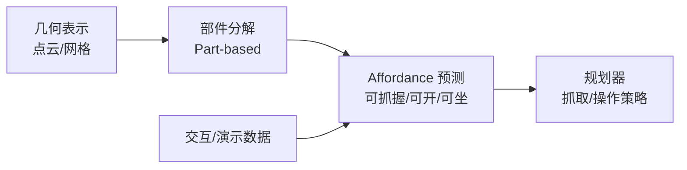

<ModuleProgress id="b09" label="可供性（Affordance）" />

## 为什么重要

椅子不是"一堆点云"，而是"可以坐的东西"。Affordance（可供性）把空间表示从"世界是什么"转向"世界允许我做什么"——这是感知与行动之间的接口，也是机器人智能区别于纯视觉的核心。

## 直观理解

Affordance 的两条输入线索：几何结构（杯把的形状暗示可抓）与功能经验（演示中人在哪里抓）。输出直接对接规划——这是"面向行动的表示"。

## 核心思想

**Affordance** 概念源于 Gibson（1979）的生态心理学：环境为行动者提供行动可能性——门把手"afford"转动，平地"afford"行走。关键论点：affordance 是**环境与行动者之间的关系**，不是物体自身的属性——同一扇门对人是通道、对履带机器人是墙。这决定了 affordance 表示必须以（物体/部位，动作）为索引。

**Part-based 视角**（UCSD Hao Su 组的特色方向）把 affordance 锚定在部件级：PartNet 提供细粒度层级部件标注，使"柜门可拉开、抽屉可抽出"这类部件级功能推理成为可能。部件的 mobility（可动性：旋转副/平移副及其轴）是几何到功能的中间表示——知道铰链轴就能预测开门轨迹，这几乎是一个微型的解析世界模型。

学习 affordance 的数据瓶颈是根本挑战：几何可以从照片恢复，功能必须从**交互或演示**获得。机器人领域的做法包括从人类视频提取抓取位姿、在仿真中主动交互采样、以及用 VLM 从语义先验迁移（"杯子都有把"）。Affordance 与规划的接口则把它变成决策资源：规划器查询"哪里可抓"而非"什么是椅子"。

## 关键概念

- **Affordance（Gibson）**：环境与行动者之间的行动可能性。
- **部件级功能**：PartNet 式细粒度标注，affordance 的结构化载体。
- **Mobility**：部件的运动学（铰链/滑轨轴），几何到功能的中间层。
- **从演示/交互学习**：功能数据无法从被动观测免费获得。
- **感知-行动接口**：规划器消费 affordance 而非原始几何。

## 核心公式

本模块以直觉为主。Affordance 预测可形式化为条件分布 $p(\text{success} \mid x, a)$——在部位/位姿 $x$ 执行动作 $a$ 的成功概率。

## 大学课程

| 课程 | Lecture | 链接 |
|---|---|---|
| UCSD Machine Learning Meets Geometry (WI22) | Part-based 3D Analysis、Mobility、Zero-shot 3D Understanding | [课程主页](https://haosulab.github.io/ml-meets-geometry-WI22/) |

## 论文

- **Must Read**：Mo et al. (2019), *PartNet: A Large-Scale Benchmark for Fine-Grained and Hierarchical Part-Level 3D Object Understanding*（[arXiv:1812.02713](https://arxiv.org/abs/1812.02713)）。
- **Recommended**：Gibson (1979), *The Ecological Approach to Visual Perception*（经典著作，affordance 概念源头）；Locatello et al. (2020), *Object-Centric Learning with Slot Attention*（[arXiv:2006.15055](https://arxiv.org/abs/2006.15055)）——无监督物体分解的相邻技术。
- **Optional**：Florence, Manuelli & Tedrake (2018), *Dense Object Nets*（[arXiv:1806.08756](https://arxiv.org/abs/1806.08756)）——稠密对应作为操作表示。

## 动手实践

Lab 9的机器人闭环会用到 affordance 式查询；现阶段可在 PartNet 数据集上可视化部件标注，建立"部件-功能"直觉。

**Open Lab**：<ColabBadge lab="lab09_world_model_policy" />

## 自测

1. 为什么说 affordance 是关系而非物体属性？
2. 部件 mobility（如铰链轴）为什么可以看作微型世界模型？
3. Affordance 学习的数据瓶颈与几何重建有何本质不同？

显示答案

1. 同一个"地面"对人 afford 行走、对无人机不 afford；同一扇门对宽度小于门洞的机器人是通道、否则是障碍。Affordance 依赖行动者的身体与能力模型，必须以（环境元素 × 行动者）为索引，这正是具身智能"身体形态决定感知"的实例。
2. 知道铰链轴与门扇几何，就能预测"施加扭矩后门如何运动"——这是一个解析的、单部件的 transition model。移动部件的操作规划（开门、拉抽屉）本质上是在查询这个微型世界模型。
3. 几何有被动监督（照片、深度、多视角一致性），可以免费大规模获取；功能/affordance 必须来自交互或演示——"这个把能抓"只有抓过（或看人抓过）才知道。数据稀缺使先验迁移（语义、VLM）成为研究热点。

## 要点回顾

- Affordance 是面向行动的空间表示：环境 × 行动者的行动可能性。
- 部件级分解与 mobility 是几何通往功能的结构化中间层。
- 功能数据必须来自交互——这使 affordance 天然连着主动学习与具身数据。

## 下一模块

[模块 10：导航](./10-navigation.mdx)——把地图、记忆与 affordance 组装成第一个杀手应用。
