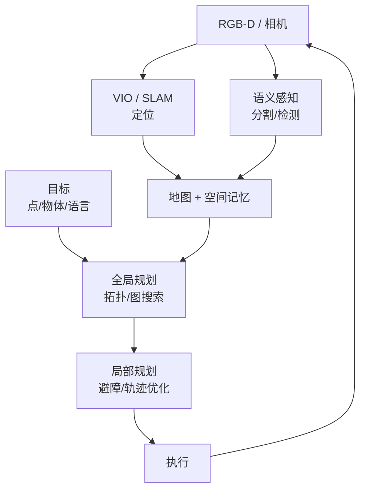

<ModuleProgress id="b10" label="导航" />

## 为什么重要

导航是空间智能的第一杀手应用：它把前面所有模块（几何、状态估计、地图、记忆、affordance）拧成一个系统。同时它也是检验"世界模型对决策到底有多大用"的最干净场景。

## 直观理解

经典导航管线：定位与建图（模块 06–08）喂给全局规划（拓扑层）与局部规划（度量层），执行产生新观测闭环回感知。

## 核心思想

**几何导航**是成熟范式：SLAM/VIO 提供定位与地图，全局规划器（A*/Dijkstra on 拓扑图或占据栅格）给出路径，局部规划器（轨迹优化、动态窗口）处理实时避障。MIT VNAV 的整门课就是这个管线的教科书：从几何基础到 minimum-snap 轨迹优化，再到无人机平台上的完整部署。管线的耦合点是本课程的要点——定位误差会毒化地图，地图错误会误导规划，评估必须端到端。

**学习型导航**把目标从"到坐标 (x, y)"扩展到语义与语言：PointGoal（到坐标）、ObjectGoal（"找到冰箱"）、Vision-and-Language Navigation（"走到客厅左转"）。CMP（Cognitive Mapping and Planning, 2017）是学习侧的原点：网络内部维护可微的空间记忆地图并在其上规划——这正是"空间记忆 + 世界模型"架构的学习版。

世界模型在导航中的角色正在显形：导航世界模型（Navigation World Models 类工作）学习**预测下一步观测/占据**，让智能体在执行前"想象"路线的后果——把 路线 A 的 imagination 思想搬到度量空间。这与模块 11–12 的机器人世界模型、VLA 直接衔接。

## 关键概念

- **全局规划 vs 局部避障**：拓扑层的路径搜索 vs 度量层的实时轨迹。
- **PointGoal / ObjectGoal / VLN**：导航目标的三个抽象层级。
- **认知地图式学习**：可微空间记忆 + 学习规划（CMP 范式）。
- **导航世界模型**：想象未来观测辅助路线决策。
- **Sim-to-real**：仿真训练、真实部署的鸿沟（模块 11 展开）。

## 核心公式

占据栅格上的全局规划目标：

$$\min_{\pi} \sum_{t} c(s_t, a_t), \qquad \text{s.t. } s_{t+1} = f(s_t, a_t),\; s_t \notin \mathcal{O}_{\text{occupied}}$$

## 大学课程

| 课程 | Lecture | 链接 |
|---|---|---|
| MIT 16.485 VNAV | 整门课即视觉导航（VO/VIO + 轨迹优化 L08–L10 + 无人机平台） | [课程主页](https://vnav.mit.edu/) |

## 论文

- **Must Read**：Gupta et al. (2017), *Cognitive Mapping and Planning for Visual Navigation*（CMP，[arXiv:1702.03920](https://arxiv.org/abs/1702.03920)）。
- **Recommended**：Anderson et al. (2018), *Vision-and-Language Navigation*（VLN，[arXiv:1711.07280](https://arxiv.org/abs/1711.07280)）。
- **Optional**：Bar et al. (2024), *Navigation World Models*（搜索论文名，2024）——视频预测式导航世界模型。

## 动手实践

Lab 8：在轻量导航仿真中构建"预测下一步观测/占据 + 辅助规划"的管线，并在 EuRoC 序列上评估状态估计基线。

**Open Lab**：<ColabBadge lab="lab08_navigation_world_model" />

## 自测

1. 全局规划为什么通常在拓扑层而非度量层做？
2. CMP 相对经典 SLAM + 规划管线的根本区别是什么？
3. 导航中"想象未来观测"相比"直接输出动作"的优势是什么？

显示答案

1. 度量栅格上的搜索复杂度随地图尺寸爆炸，且远距离规划不需要厘米级精度；拓扑图把空间压成地点节点与边，搜索是图算法（高效、可扩展），细节交给局部规划器处理。分层是复杂系统的一般解法。
2. 经典管线是手工模块的串联（估计 → 建图 → 规划），各模块独立训练/设计、误差逐级传播；CMP 把地图与规划器做成可微网络内部结构，端到端从任务目标学习——记忆存什么、规划怎么用都由任务反向塑造。
3. 想象观测（世界模型路线）把决策建立在可解释的预测上：可以评估多条候选路线的后果再选；直接输出动作（反应式策略）是黑箱映射，分布外时失效不可诊断。前者还支持同一模型服务多种目标——模型与任务解耦。

## 要点回顾

- 导航 = 定位 + 地图 + 分层规划的闭环，是前面所有模块的系统集成。
- 学习目标从坐标走向语义与语言，空间记忆成为可微内部结构。
- 导航世界模型把 imagination 引入度量空间，是通往机器人世界模型的桥。

## 下一模块

[模块 11：机器人世界模型](./11-robot-world-models.mdx)——把闭环装上真实的身体。
