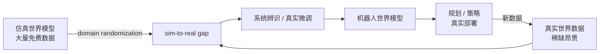

<ModuleProgress id="b11" label="机器人世界模型" />

## 为什么重要

仿真里再漂亮的 imagination，装上真实机器人才见真章：传感器噪声、接触动力学、复位成本都是仿真没有的。机器人世界模型是 路线 A 方法论在物理世界的压力测试。

## 直观理解

机器人世界模型的核心矛盾：仿真数据免费但不真，真实数据真但昂贵。domain randomization、系统辨识与世界模型辅助的样本效率是弥合鸿沟的三件工具。

## 核心思想

**Sim-to-real** 是机器人学习的第一性问题。仿真器本身是手工世界模型——它的模型误差（reality gap）集中在接触、摩擦、形变等物理难区。**Domain randomization**（Tobin et al., 2017）的策略是"以毒攻毒"：随机化仿真的视觉与物理参数，让策略/模型见过足够多样的"假世界"，真实世界就成为分布内的一个样本。系统辨识走相反路线：用真实数据反推仿真参数，把假世界调真。

**在真实机器人上学世界模型**的可行性由 DayDreamer（2022，路线 A 模块 11 已介绍其 MBRL 机制）首次系统证明：几小时真实交互内学会四足行走与抓取——关键约束是自动复位、安全边界与小任务设计。真实学习的瓶颈从算法转向**系统工程**：谁把机器人摆回初始状态、失败了如何安全停机。

**DINO-WM**（2024）代表了新范式：不从头学表示，而是冻结预训练视觉基础模型（DINOv2）的特征作为观测空间，在其上学习潜动力学与规划——预训练表征把 sim-to-real 的视觉鸿沟预先填平。这呼应 路线 A 模块 04 的论断：表示质量决定世界模型上限，而基础模型把表示学习外包给了互联网规模的数据。

## 关键概念

- **Reality gap**：仿真模型误差集中区（接触/摩擦/形变）。
- **Domain randomization**：用分布宽度覆盖真实世界。
- **系统辨识**：用真实数据校准仿真参数。
- **真实世界 RL**：自动复位与安全约束下的在线学习（DayDreamer）。
- **冻结表征 + 动力学**：DINO-WM 式的基础模型嫁接路线。

## 核心公式

Domain randomization 的目标（在随机化参数分布 $\Xi$ 上优化最坏/期望性能）：

$$\theta^* = \arg\max_\theta\, \mathbb{E}_{\xi \sim \Xi}\big[ J(\theta; \xi) \big]$$

## 大学课程

| 课程 | Lecture | 链接 |
|---|---|---|
| UPenn CIS 6280 World Models | L18 Robot Learning I（sim-to-real、domain randomization、系统辨识；Resources 含 DayDreamer、DINO-WM） | [课程主页](https://jiataogu.me/cis6280-world-models/) |

## 论文

- **Must Read**：Wu et al. (2022), *DayDreamer: World Models for Physical Robot Learning*（[arXiv:2206.14176](https://arxiv.org/abs/2206.14176)）。
- **Recommended**：Tobin et al. (2017), *Domain Randomization for Transferring Deep Neural Networks from Simulation to the Real World*（[arXiv:1703.06907](https://arxiv.org/abs/1703.06907)）；Zhou et al. (2024), *DINO-WM*（搜索论文名，2024）——冻结 DINOv2 特征上的世界模型与规划。
- **Optional**：Todorov, Erez & Tassa (2012), *MuJoCo: A Physics Engine for Model-Based Control*（搜索论文名）——手工世界模型的对照基准。

## 动手实践

Lab 9：MBRL 闭环的工程版本。路线 B 学习者重点关注 imagination 与真实 rollout 的回报偏差分析——那是 reality gap 的直接度量。

**Open Lab**：<ColabBadge lab="lab09_world_model_policy" />

## 自测

1. Domain randomization 与系统辨识分别用什么策略弥合 reality gap？
2. DayDreamer 在真实机器人上学习，最大的工程约束是什么？
3. DINO-WM 冻结预训练表征的好处与风险各是什么？

显示答案

1. Randomization 是"加宽训练分布"：让模型在大量扰动过的假世界上训练，期望真实世界落在分布内——不追求仿真准确，追求策略鲁棒。系统辨识是"校准仿真"：用真实数据反推物理参数（质量、摩擦），让假世界逼近真世界。前者改训练分布，后者改模型本身，实践中常组合使用。
2. 不是算法而是复位与安全：在线学习必然产生大量失败 trial，需要自动复位机制（如机械臂回零位、安全笼）与碰撞/力矩硬约束，否则硬件损坏或伤害风险使实验不可行。任务设计（回合短、状态可恢复）决定可行性。
3. 好处：视觉理解直接从互联网级数据继承，sim-to-real 的视觉鸿沟消失，小数据即可学动力学。风险：冻结特征可能丢弃与控制相关的细节（精确深度、接触力线索），且特征空间的动力学可预测性没有保证——表征好不代表可预测（回想 路线 A 模块 05 的设计准则）。

## 要点回顾

- 机器人世界模型的核心矛盾：仿真免费不真 vs 真实真但昂贵。
- Randomization、系统辨识、真实在线学习是弥合 reality gap 的三件工具。
- 基础模型表征嫁接（DINO-WM）预示机器人世界模型的下一个范式。

## 下一模块

[模块 12：VLA 与世界-动作模型](./12-vla-world-action-models.mdx)——大模型时代的机器人策略与世界模型交汇处。
