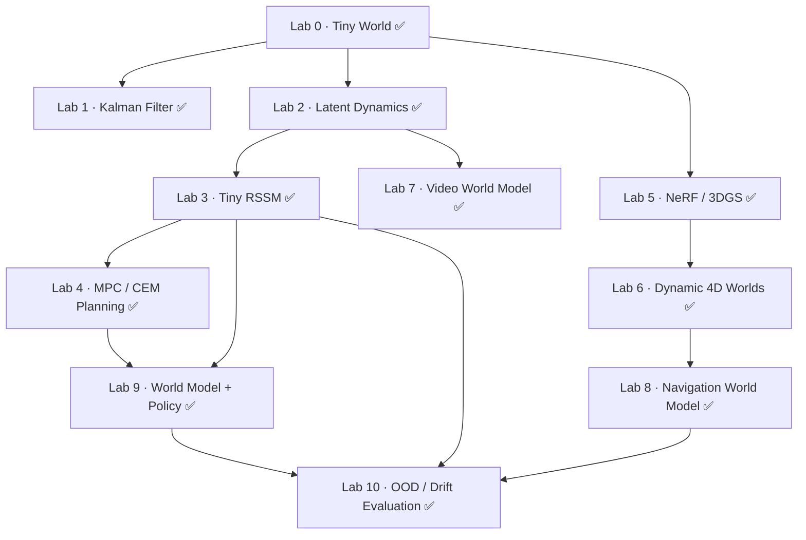

import ColabBadge from '@site/src/components/ColabBadge';

# Hands-on Labs

Every lab is a Colab notebook designed to run end-to-end on the **free tier**, and all of them run on CPU — small models, small datasets, precomputed assets where needed. Nothing to install locally.

:::tip Currently available
**All 11 labs are live**, and every one runs on CPU.
:::

Lab order is a suggestion, not a requirement: the Scientist track leans on Labs 1–4, 7, 9, 10; the Engineer track on Labs 1, 5, 6, 8, 9, 10. The capstone is shared.

Lab status is maintained centrally in [`labs/manifest.json`](https://github.com/overdued/world-model-spatial-intelligence-course/blob/main/labs/manifest.json): ✅ Ready (one-click runnable) / 🚧 In Development / 📋 Planned. Only ✅ labs show a Colab badge.

## Lab Dependency Graph

Scientist main line: `Lab 0 → 1 → 2 → 3 → 4 → 9 → 10` (Observation → State → Representation → Dynamics → Imagination → Planning → Policy → Evaluation). Spatial main line: `Lab 0 → 5 → 6 → 8 → 10`. Video side branch: `Lab 2 → 7`.

| Lab | What you build | Status | Open |
| --- | --- | --- | --- |
| **Lab 0 · Tiny World** | A Gymnasium-compatible environment from scratch — the testbed for everything after | ✅ Ready (CPU ~5s) | <ColabBadge lab="lab00_tiny_world" /> |
| **Lab 1 · Kalman Filter** | Hand-written KF predict–update loop tracking a noisy 2D target, compared against dynamax | ✅ Ready (CPU ~3s) | <ColabBadge lab="lab01_kalman_filter" /> |
| **Lab 2 · Latent Dynamics** | VAE encoder + latent transition model: the minimal observation → latent → prediction loop | ✅ Ready (CPU ~1min) | <ColabBadge lab="lab02_latent_dynamics" /> |
| **Lab 3 · Tiny RSSM** | A simplified RSSM (deterministic GRU + stochastic latent, KL training) on image observations | ✅ Ready (CPU ~3min) | <ColabBadge lab="lab03_tiny_rssm" /> |
| **Lab 4 · MPC / CEM Planning** | CEM and MPPI planners on your learned latent dynamics — model + planner = controller | ✅ Ready (CPU ~15s) | <ColabBadge lab="lab04_mpc_cem_planning" /> |
| **Lab 5 · NeRF / Gaussian Splatting** | Reconstruct a static scene two ways: a tiny NeRF and 3DGS, with speed–quality comparison | ✅ Ready (CPU ~3.5min) | <ColabBadge lab="lab05_nerf_gaussian_splatting" /> |
| **Lab 6 · Dynamic 4D Worlds** | Extend Lab 5 along the time axis: 4D Gaussians or deformation-field NeRF | ✅ Ready (CPU ~10s) | <ColabBadge lab="lab06_dynamic_4d_worlds" /> |
| **Lab 7 · Video World Model** | A small action-conditioned video predictor (diffusion/flow matching) — watch drift happen | ✅ Ready (CPU ~2min) | <ColabBadge lab="lab07_video_world_model" /> |
| **Lab 8 · Navigation World Model** | A navigation world-model pipeline with partial observability: reactive vs memory vs world-model agents | ✅ Ready (CPU ~30s) | <ColabBadge lab="lab08_navigation_world_model" /> |
| **Lab 9 · World Model + Policy** | Full MBRL closed loop: actor-critic in imagination (Dreamer-style) or TD-MPC-style planning | ✅ Ready (CPU ~45s) | <ColabBadge lab="lab09_world_model_policy" /> |
| **Lab 10 · OOD / Drift Evaluation** | A standardized "health check" for your trained world model: calibration, rollout error, drift | ✅ Ready (CPU ~2.5min) | <ColabBadge lab="lab10_ood_drift_evaluation" /> |

## Capstone

**Build Your Own World Model** — pick a domain (physical systems, video & spatial worlds, robot learning, or language & digital agents), explicitly declare the modeled **state, transition, action interface and evaluation criteria**, then build and evaluate end-to-end. Details live at the end of each track ([Scientist](/docs/scientist/13-capstone) · [Engineer](/docs/spatial/13-capstone)).

:::note Starter code
Starter code and evaluation scripts live in the [`labs/`](https://github.com/overdued/world-model-spatial-intelligence-course/tree/main/labs) directory of the repository — notebooks themselves run on Colab.
:::
