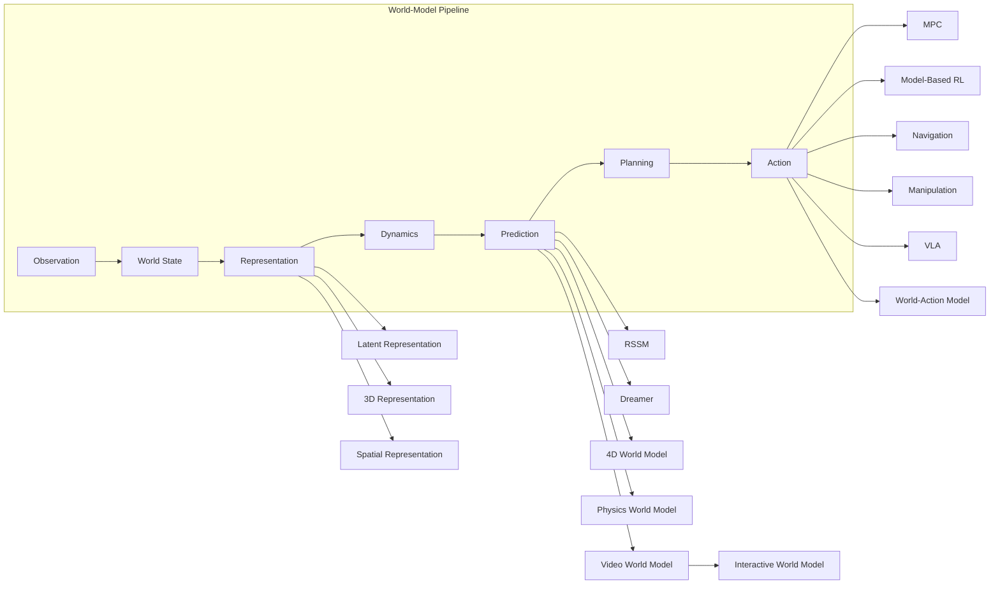

# Course Roadmap

The whole course on one map. The **trunk** is the world-model pipeline every intelligent system runs; the **branches** are where the two tracks diverge and specialize. **Click any node** to jump into the corresponding module.

## How to read this map

- **🧑‍🔬 World Model Scientist** owns the trunk — representation, latent dynamics, prediction and planning — plus the video/generative branch. Start with [Track A](/docs/scientist/).
- **👷 Spatial & Embodied Engineer** owns the spatial branches — 3D/4D representation, spatial memory, navigation and robot action. Start with [Track B](/docs/spatial/).
- **🧩 Foundations** ([/docs/fundamentals/](/docs/fundamentals/)) sits underneath everything — optional, non-linear, consult it when a module assumes something you don't have.

The two tracks are **parallel, not sequential**: they share the same questions (what is the state of the world, how do we predict it, what happens when the prediction is wrong) and the same reliability layer (OOD, drift, evaluation).
