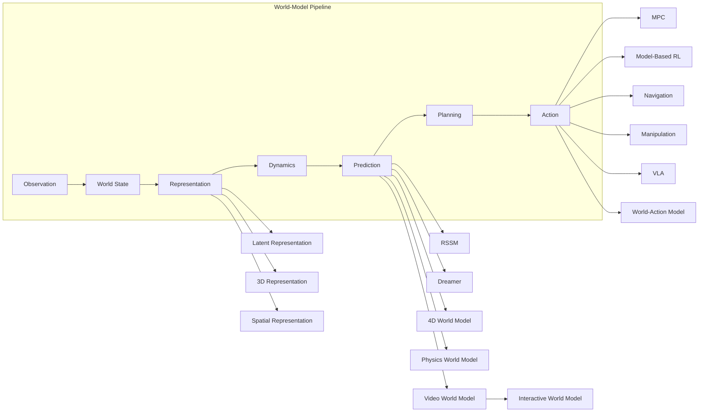

# 课程路线图

整张课程尽在一张地图上。**主干**是每个智能系统都会跑通的世界模型流水线；**分支**是两条路线分头深入的方向。**点击任意节点**即可跳转到对应模块。

## 如何读这张图

- **🧑‍🔬 World Model Scientist** 拥有主干——表征、隐动力学、预测与规划——外加视频/生成分支。从 [Track A](/docs/scientist/) 开始。
- **👷 Spatial & Embodied Engineer** 拥有空间分支——3D/4D 表征、空间记忆、导航与机器人动作。从 [Track B](/docs/spatial/) 开始。
- **🧩 Foundations**（[/docs/fundamentals/](/docs/fundamentals/)）托在一切之下——可选、非线性，当某个模块用到了你还没有的基础时随时查阅。

两条路线是**并行的，而非先后的**：它们共享同一组问题（世界的状态是什么、如何预测它、预测错了会怎样），也共享同一层可靠性保障（OOD、漂移、评估）。
